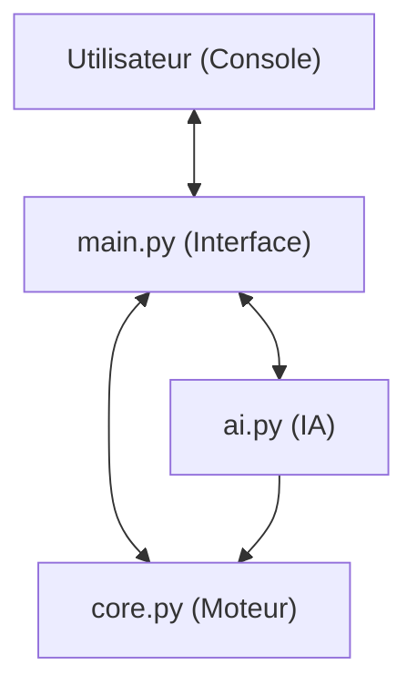

# 🎮 Comprendre le Jeu Quoridor & son IA

Ce document détaille le fonctionnement technique du projet Quoridor, en mettant l'accent sur l'intelligence artificielle et l'architecture globale du jeu.

---

## 🏗️ Architecture Globale

Le projet est structuré en trois couches principales, garantissant une séparation claire entre la logique, l'intelligence et l'affichage.

### 1. Le Moteur (`core.py`)

C'est le cœur du jeu. Il gère :

* **L'état du jeu (`GameState`)** : Une structure de données immuable contenant les positions des joueurs, les murs posés et le nombre de murs restants.
* **Les règles de déplacement** : Gestion des déplacements simples, des sauts par-dessus l'adversaire et des sauts diagonaux.
* **Le placement des murs** : Validation géométrique (pas de chevauchement) et stratégique (interdiction de bloquer totalement un joueur).

### 2. L'Interface (`main.py`)

Gère l'interaction avec l'utilisateur via la console :

* Affichage d'un plateau 9x9 textuel (converti en grille 17x17 pour afficher les murs).
* Saisie des commandes en notation type "échecs" (ex: `d e5`, `m h e3`).
* Boucle de jeu principale et gestion des modes (PvP ou PvIA).

---

## 🧠 L'Intelligence Artificielle en Détails

L'IA du projet utilise l'algorithme **Minimax** avec **élagage Alpha-Bêta**, agrémenté de plusieurs optimisations avancées.

### 1. L'Algorithme : Minimax & Alpha-Bêta

L'IA explore les futurs coups possibles en construisant un arbre de décision.

* **Minimax** : L'IA maximise son score tandis qu'elle suppose que l'adversaire jouera le coup qui minimise ce score.
* **Élagage Alpha-Bêta** : Permet d'ignorer des branches entières de l'arbre qui ne peuvent pas influencer le résultat final, augmentant drastiquement la vitesse de calcul.

### 2. Le "Cerveau" : La Fonction d'Évaluation

Comme l'IA ne peut pas voir jusqu'à la fin de la partie (trop de combinaisons), elle évalue chaque position intermédiaire avec un score numérique basé sur :

| Critère | Explication |
| :--- | :--- |
| **Distance (L1)** | La différence entre la distance de l'adversaire au but et celle de l'IA (calculée par BFS). |
| **Robustesse / Fragilité** | Analyse si le joueur a un seul chemin (fragile) ou plusieurs alternatives (robuste). |
| **Gestion des Murs** | Bonus pour les murs restants, surtout si l'adversaire approche du but. |
| **Mobilité** | Nombre de déplacements immédiats possibles (plus il y en a, mieux c'est). |

### 3. Optimisations Clés

#### 🚀 Recherche par Plus Court Chemin (BFS)

L'IA utilise un algorithme **BFS (Breadth-First Search)** pour calculer les distances exactes vers l'objectif en tenant compte des murs. Pour gagner du temps, elle utilise un **BFS inversé** : elle calcule les distances depuis la ligne d'arrivée vers toutes les cases en une seule fois.

#### ⚡ Validation Paresseuse des Murs

Au lieu de vérifier si un mur bloque un joueur (opération coûteuse) pour TOUS les murs possibles, l'IA :

1. Vérifie si le mur coupe le chemin actuel du joueur.
2. Si non, le mur est forcément valide (gain de temps immense).

#### 🗃️ Table de Transposition (Cache)

L'IA mémorise les évaluations des états déjà rencontrés pour éviter de recalculer les mêmes positions plusieurs fois.

#### 📉 Tri des Coups (Heuristique d'Historique)

L'IA teste en priorité les coups qui semblent les plus prometteurs (comme avancer vers le but), ce qui permet à l'élagage Alpha-Bêta d'être beaucoup plus efficace.

---

## 🛠️ Résumé Technique

* **Langage** : Python 3
* **Complexité IA** : O(b^d) réduit par Alpha-Bêta (b=facteur de branchement, d=profondeur).
* **Profondeur typique** : 4 à 6 coups d'avance selon la difficulté.
