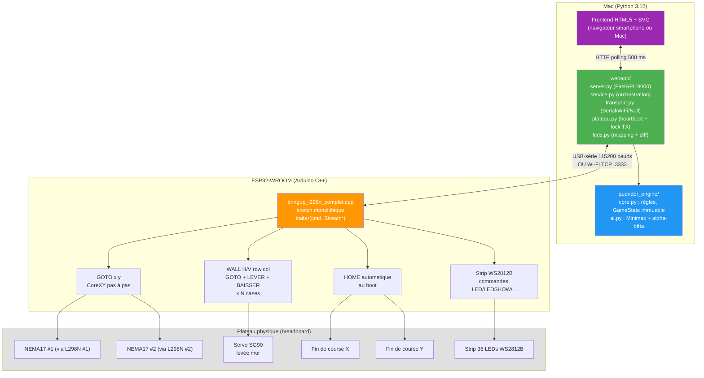
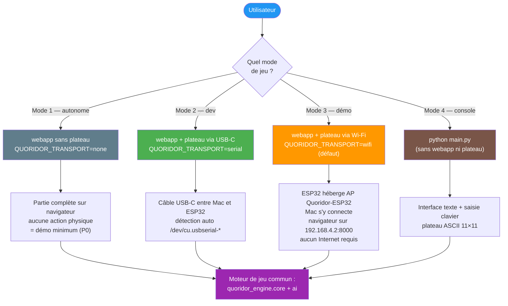
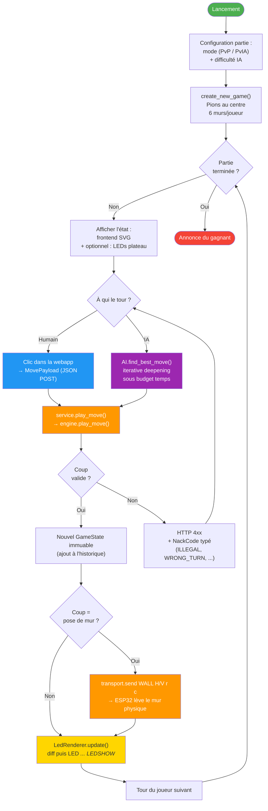

# Vue générale du système

Ce document présente l'architecture globale du projet Quoridor mécatronique
**après le pivot du 2026-05-20** : un Mac qui exécute toute la logique
logicielle (moteur de jeu, IA, webapp) et un ESP32 qui pilote l'actuation
physique du plateau (CoreXY, servo, LEDs). Communication par USB-série
en développement, par Wi-Fi en démo.

Pour l'historique des décisions ayant mené à cette architecture, voir
[`../decisions.md`](../decisions.md).

---

## Architecture matérielle et logicielle

Le Mac est le **seul cerveau du jeu** : règles, IA, état de partie, interface
utilisateur. L'ESP32 est un **actionneur intelligent** : il reçoit des
commandes texte et traduit chaque instruction en mouvement physique ou
en affichage LED.

---

## Répartition des responsabilités

| Couche | Rôle | Code |
|---|---|---|
| **Moteur de jeu** | Règles Quoridor, validation des coups, `GameState` immuable, pathfinding BFS anti-blocage | `quoridor_engine/core.py` |
| **Intelligence artificielle** | Minimax + alpha-bêta + iterative deepening + table de transposition | `quoridor_engine/ai.py` |
| **Webapp serveur** | FastAPI, routes API, `QuoridorService` singleton, polling | `webapp/server.py`, `webapp/service.py` |
| **Transport Mac ↔ ESP32** | Interface `Transport` + 3 impls (Serial, WiFi, Null), factory pilotée par env var | `webapp/transport.py` |
| **Pont plateau** | `PlateauBridge` : heartbeat, lock TX, reconnexion auto, bascule à chaud | `webapp/plateau.py` |
| **Affichage LEDs** | Mapping engine↔strip serpentin, classe `LedRenderer` avec diff | `webapp/leds.py` |
| **Frontend** | HTML5 + CSS3 + SVG inline + JS vanilla, zéro framework | `webapp/static/` |
| **Firmware ESP32** | CoreXY, servo, fins de course, strip LED, dispatch Serial+WiFi | `firmware/src/bringup_l298n_complet.cpp` |
| **Interface console** | CLI texte alternative (sans plateau ni webapp) | `main.py` |

---

## Les trois modes d'exécution

---

## Boucle de jeu (vue logique commune)

---

## Principes de conception

1. **Séparation moteur / interface** : `quoridor_engine` ne connaît ni la
   webapp, ni le hardware. La même logique alimente console, webapp et
   plateau.
2. **Immutabilité de `GameState`** : chaque coup retourne un nouvel état.
   Permet l'undo, l'arbre de recherche de l'IA et le hash de la table de
   transposition.
3. **Validation centralisée côté Mac** : l'ESP32 ne valide pas les règles
   du jeu. C'est le moteur Python qui tranche. L'ESP32 se contente
   d'exécuter les commandes hardware reçues.
4. **Fallback gracieux** : si le transport demandé échoue, la webapp
   bascule sur `NullTransport` et continue avec une bannière dégradée.
   Boutons de bascule à chaud `POST /api/transport/switch`.
5. **Pas de boutons sur le plateau** : depuis le 2026-05-21, l'interaction
   se fait exclusivement via la webapp (cf. [`../decisions.md`](../decisions.md)).
   Le plateau est un miroir physique.

---

## Pour aller plus loin

- [02_logique_ia.md](02_logique_ia.md) — détails de l'IA Minimax
- [03_logique_jeu.md](03_logique_jeu.md) — règles et validation
- [04_plateau.md](04_plateau.md) — représentation des données
- [05_firmware_esp32.md](05_firmware_esp32.md) — sketch ESP32 et commandes
- [06_protocole.md](06_protocole.md) — protocole texte Mac ↔ ESP32
- [07_webapp_flux.md](07_webapp_flux.md) — couches webapp et flux HTTP
