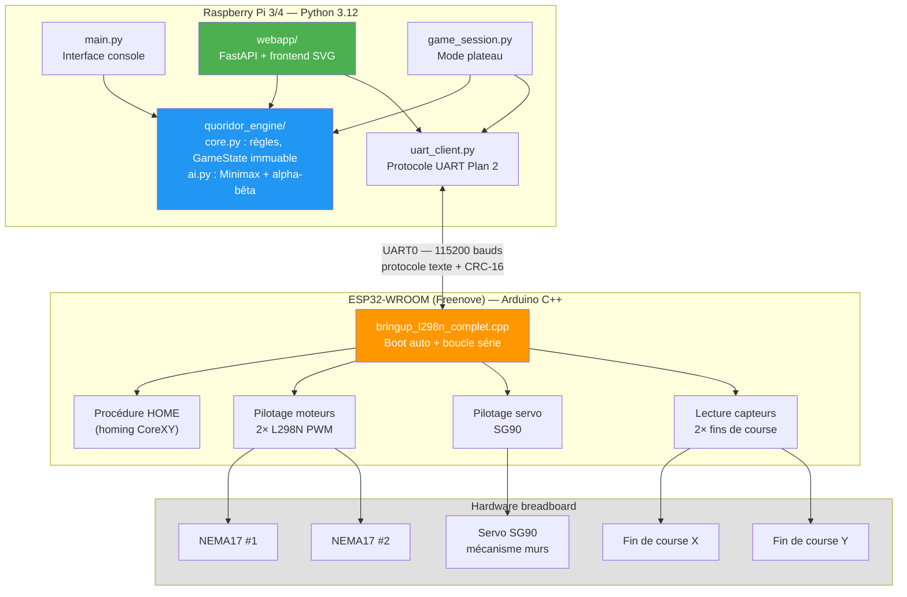
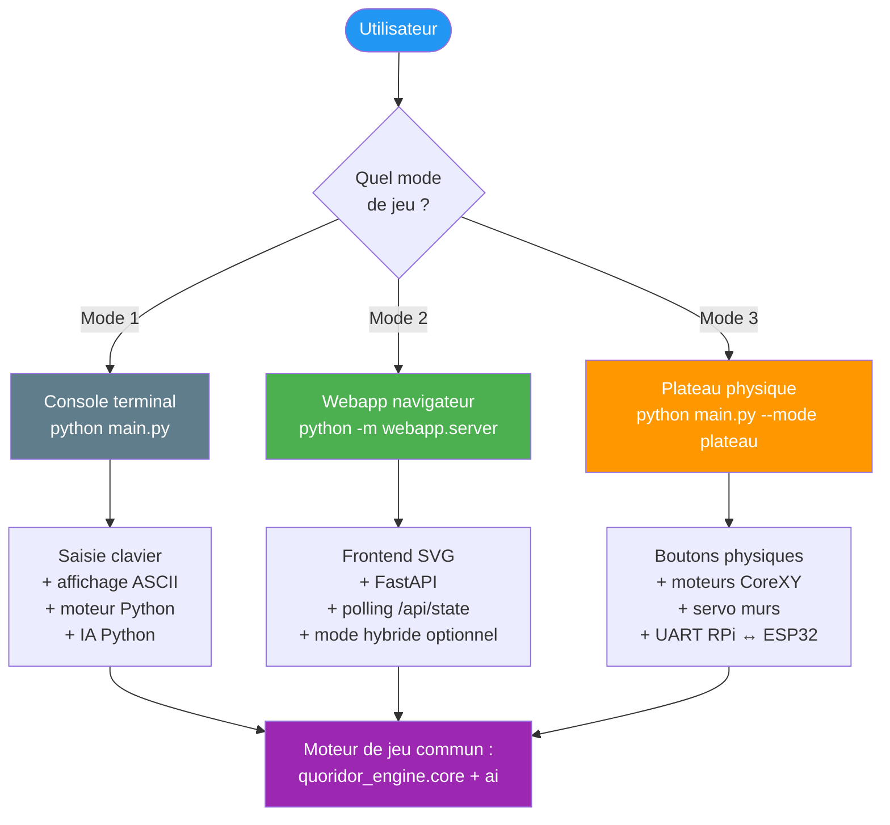
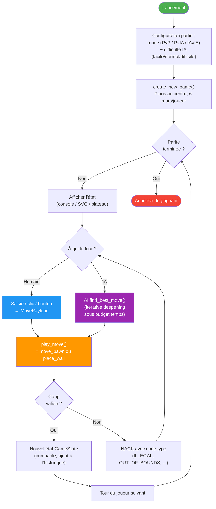

# Vue générale du système

Ce document présente l'architecture globale du projet Quoridor mécatronique : deux processeurs (Raspberry Pi + ESP32), trois modes d'utilisation (console, webapp, plateau physique), et un canal de communication série UART.

---

## Architecture matérielle et logicielle

---

## Répartition des responsabilités

| Couche | Rôle | Code |
|---|---|---|
| **Moteur de jeu** | Règles, validation, GameState immuable, undo | `quoridor_engine/core.py` |
| **Intelligence artificielle** | Minimax + alpha-bêta + iterative deepening | `quoridor_engine/ai.py` |
| **Interface console** | UI texte, plateau ASCII 11×11 | `main.py` |
| **Webapp démo** | API REST + frontend SVG navigateur | `webapp/server.py`, `webapp/service.py` |
| **Mode plateau** | Orchestration RPi ↔ ESP32 via UART | `quoridor_engine/game_session.py` |
| **Protocole UART** | Trames texte + CRC-16 + retry | `quoridor_engine/uart_client.py` |
| **Firmware ESP32** | Bring-up CoreXY + servo + capteurs | `firmware/src/bringup_l298n_complet.cpp` |

---

## Les trois modes d'utilisation

---

## Boucle de jeu (vue logique commune)

---

## Principes de conception

1. **Séparation moteur / interface** : `quoridor_engine` ne sait rien de la console, du navigateur ni du hardware. La même logique est réutilisée dans les trois modes.
2. **Immutabilité de `GameState`** : chaque coup retourne un nouvel état. Permet l'undo, l'arbre de recherche de l'IA, et le hash pour la table de transposition.
3. **Validation centralisée côté RPi** : l'ESP32 valide *le moins possible*. C'est le moteur Python qui tranche, parce qu'il détient les règles complètes du Quoridor.
4. **Fallback gracieux** : le mode webapp fonctionne sans plateau ; le mode hybride bascule en mode autonome si l'ESP32 se déconnecte en cours de partie.

> **Pour aller plus loin** : `02_logique_ia.md` détaille l'IA, `03_logique_jeu.md` détaille les règles, `04_plateau.md` détaille la représentation des données, `05_firmware_esp32.md` détaille le firmware, `06_protocole_uart.md` détaille la communication, `07_webapp_flux.md` détaille la webapp.
