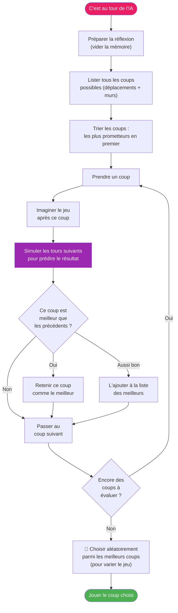
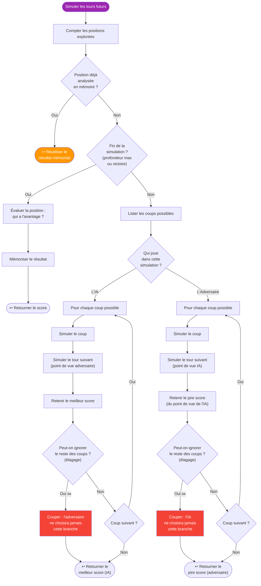
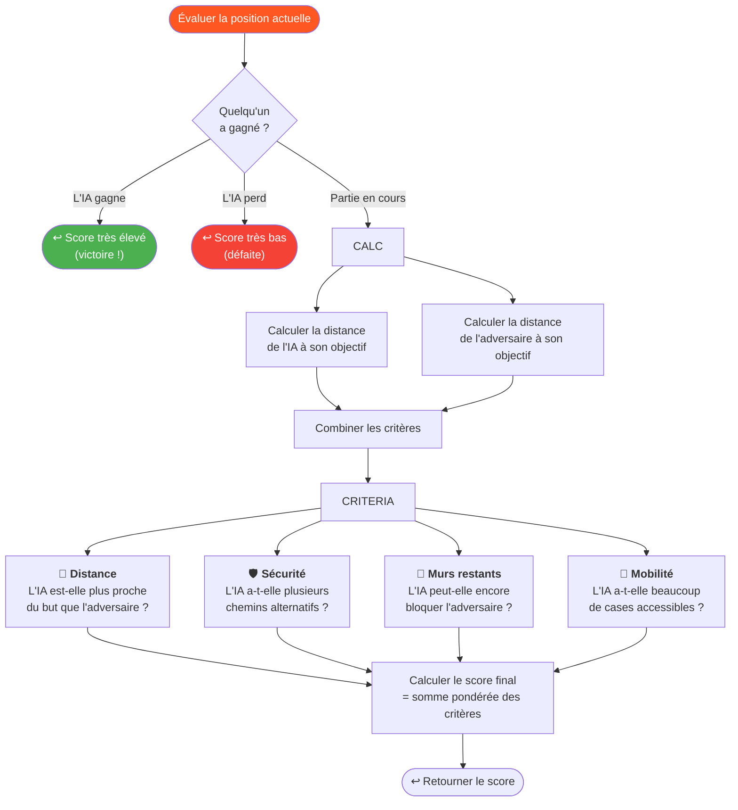
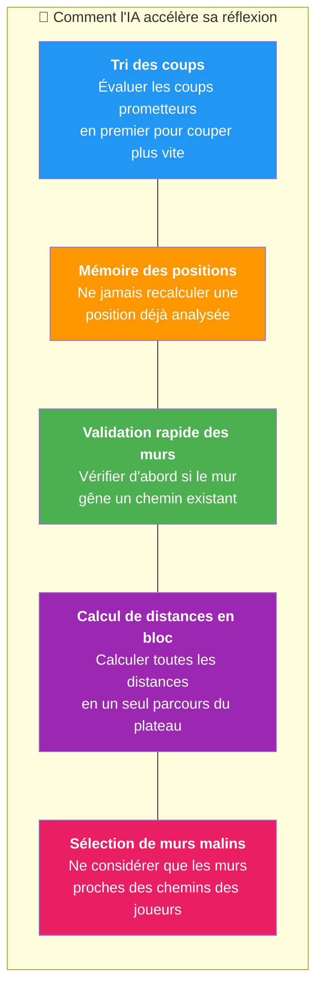

# 🤖 Logique de l'Intelligence Artificielle

Ce diagramme détaille comment l'IA du Quoridor réfléchit et choisit son coup. Elle utilise l'algorithme **Minimax avec élagage Alpha-Bêta**.

---

## Comment l'IA choisit son coup

---

## Simulation des tours futurs (Minimax)

L'IA imagine les coups futurs en alternant entre **son point de vue** (maximiser son avantage) et celui de **l'adversaire** (minimiser l'avantage de l'IA).

---

## Comment l'IA évalue une position

Quand l'IA ne peut pas simuler plus loin, elle donne un **score** à la position. Ce score reflète à quel point la situation est favorable.

---

## Astuces d'optimisation de l'IA

---

> **En résumé :** L'IA imagine les prochains coups à l'avance, suppose que l'adversaire joue au mieux, et choisit le coup qui lui donne le plus d'avantage. Plus la difficulté est élevée, plus elle anticipe de coups (2 à 5 coups d'avance).
