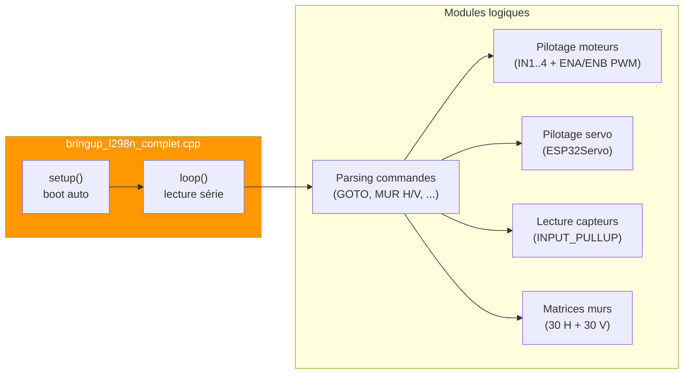
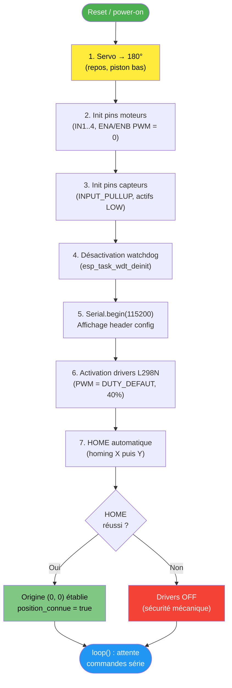
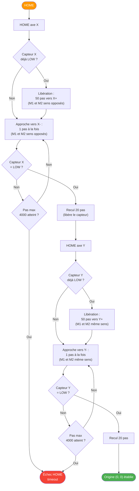
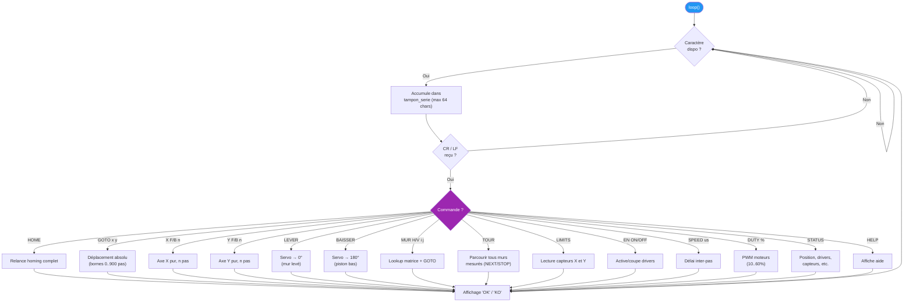
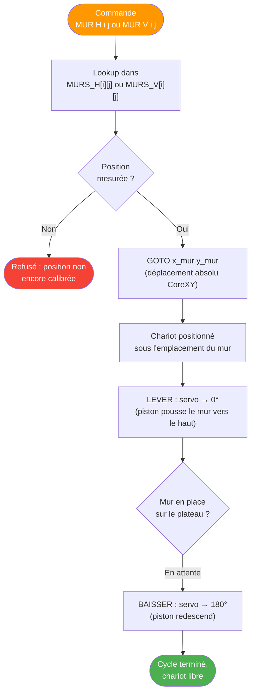

# Firmware ESP32 — bring-up CoreXY

Ce document détaille le firmware actif sur l'ESP32-WROOM : `firmware/src/bringup_l298n_complet.cpp`. Ce sketch unique combine pilotage CoreXY (2 moteurs pas à pas via L298N), servo de placement des murs, et lecture des fins de course. Validé sur breadboard le 2026-05-20 après l'abandon de la PCB v2.

---

## Vue d'ensemble du sketch

---

## Séquence de boot automatique

Au reset de l'ESP32, le firmware exécute une séquence rigoureuse en plaçant la sécurité mécanique en premier (servo retracté) avant d'activer les moteurs.

> **Sécurité critique** : le servo est mis à 180° (piston rétracté) **avant** toute activation des moteurs, pour éviter qu'un mur déjà levé n'entre en collision avec le chariot pendant le homing.

---

## Procédure HOME (homing CoreXY)

Le homing établit l'origine (0, 0) du chariot en se déplaçant vers les fins de course X- puis Y-, en exploitant la **convention CoreXY** : combiner les sens de rotation des deux moteurs pour obtenir un mouvement axial pur.

> **Convention CoreXY** mesurée et validée sur la machine :
> - **X pur** : M1 et M2 tournent en **sens opposés** → chariot bouge horizontalement seul
> - **Y pur** : M1 et M2 tournent en **même sens** → chariot bouge verticalement seul
> - **Calibration** : 100 pas full-step = 2 cm. 1 cm = 50 pas, 1 mm = 5 pas.

---

## Boucle principale et commandes série

Une fois le HOME validé, la boucle `loop()` lit le port série caractère par caractère. À chaque saut de ligne, elle dispatche vers le handler de la commande.

---

## Cycle de placement d'un mur

Le mécanisme exploite les matrices `MURS_H` (30 positions horizontales) et `MURS_V` (30 positions verticales) — un total de 60 positions de murs sur le plateau 6×6 — pré-mesurées en pas depuis l'origine.

> **Convention servo** : 180° = repos (piston rétracté), 0° = mur levé. Cette convention est mémorisée pour la sécurité : à tout reset, le servo retourne en 180°, donc aucun risque de collision pendant le HOME.

---

## Pins utilisées et contraintes

| Élément | Pins | Rôle |
|---|---|---|
| **Moteur 1 (L298N #1)** | 14, 27, 26, 25 | IN1..4 (phases) |
| Moteur 1 PWM | 33, 32 | ENA, ENB |
| **Moteur 2 (L298N #2)** | 16, 17, 21, 22 | IN1..4 (phases) |
| Moteur 2 PWM | 19, 23 | ENA, ENB |
| **Fin de course X** | 13 | INPUT_PULLUP, actif LOW |
| **Fin de course Y** | 18 | INPUT_PULLUP, actif LOW |
| **Servo SG90** | 4 | PWM (alim 5V externe) |
| **UART0** | TX/RX (USB) | 115200 bauds — debug + futur dialogue avec RPi |

**Limites de sécurité** :
- `PAS_MAX = 10 000` pas par commande
- `GOTO_MAX = 900` pas (limite plateau)
- `HOME_PAS_MAX = 4 000` pas (timeout homing)
- `DUTY` plage 10..60 % (au-delà : risque thermique L298N)
- Drivers coupés au boot **et** si HOME échoue
- Mouvements X/Y refusés si drivers OFF

---

> **Note évolutive** : ce sketch est un firmware de **bring-up validé**. La prochaine étape (Plan P11) consiste à le refactoriser pour qu'il dialogue avec le RPi via le protocole UART Plan 2 (cf. `06_protocole_uart.md`), au lieu de répondre à des commandes texte saisies au monitor série.
