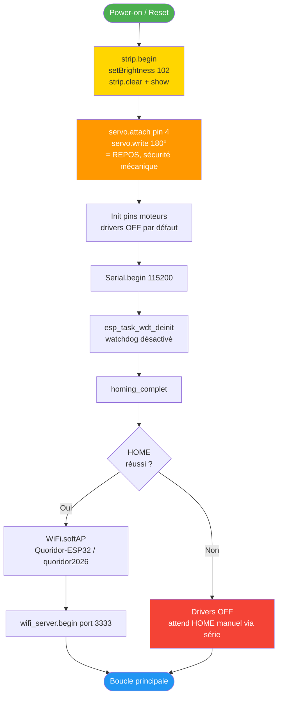
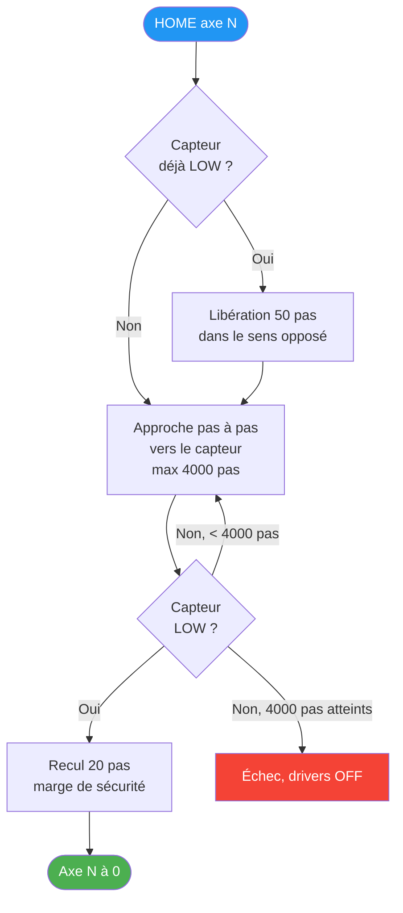
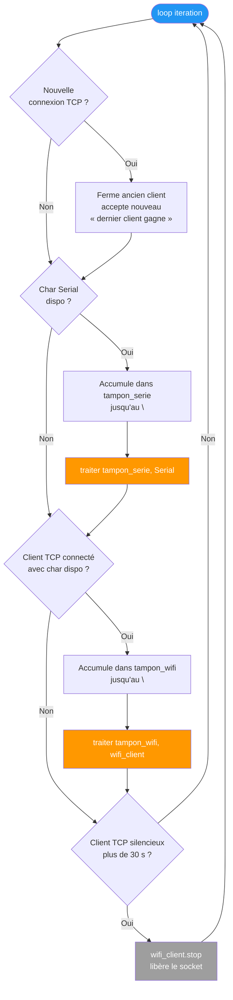
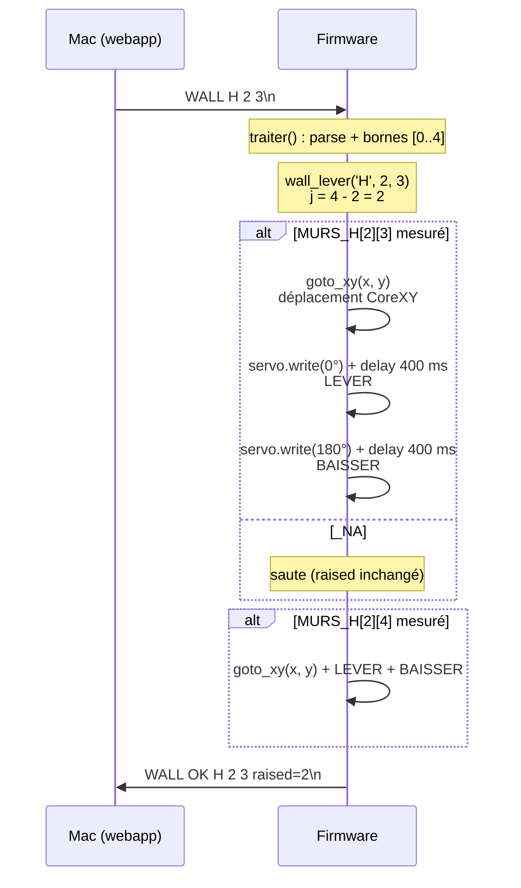

# Firmware ESP32 — bring-up et boucle de commandes

Le firmware tient dans **un seul sketch monolithique** :
[`firmware/src/bringup_l298n_complet.cpp`](../../firmware/src/bringup_l298n_complet.cpp).
Il est piloté à 100 % par commandes texte reçues sur deux canaux
interchangeables (USB-série et Wi-Fi TCP) et sert une seule logique de
dispatch via `traiter(cmd, Stream*)`.

Le firmware ne contient **aucune logique de jeu** : pas de matrice de
boutons, pas de validation de coup, pas de connaissance des règles
Quoridor. Il exécute uniquement des actions hardware (déplacement,
servo, LEDs) demandées par le Mac.

---

## Séquence de boot

**Garanties de sécurité au boot** :

1. Le servo est positionné à **180° (REPOS) en tout premier**, avant
   l'initialisation des moteurs. Évite qu'un piston levé bloque le
   chariot CoreXY.
2. Les drivers L298N sont **OFF par défaut** et n'activent les bobines
   que lors d'un mouvement demandé.
3. Le watchdog matériel ESP32 est désactivé (sketch monothread avec
   `delayMicroseconds` bloquants).

---

## Procédure HOME (par axe)

Le HOME se fait axe par axe : X d'abord, Y ensuite. Chaque axe utilise
le moteur CoreXY combiné de manière à ne bouger que sur cet axe.

**Convention CoreXY (validée machine)** :

| Mouvement | Action moteurs | Capteur |
|---|---|---|
| X pur | M1 et M2 en **sens opposés** | Pin 13 (`PIN_LIMIT_X`) |
| Y pur | M1 et M2 dans le **même sens** | Pin 18 (`PIN_LIMIT_Y`) |

Origine (0, 0) en bas-gauche après HOME complet, X croissant à droite,
Y croissant vers le haut. Voir
[`../hardware/calibration.md`](../hardware/calibration.md).

---

## Boucle principale `loop()`

**Politique « dernier client gagne »** : si un client TCP est déjà connecté
quand un nouveau arrive, l'ancien est fermé. Simplifie la gestion d'état
sans nécessiter de multi-client.

**Watchdog applicatif** : un client TCP silencieux pendant 30 s est
expulsé. Évite les sockets fantômes laissés par un client mal débranché.

---

## Cycle d'une commande `WALL`

Détail dans [`06_protocole.md`](06_protocole.md) (côté protocole) et
dans [`05_firmware.md`](../06_firmware.md) (textuel complet).

---

## Catalogue des commandes implémentées

| Commande | Effet | Détail |
|---|---|---|
| `PING` | Répond `PONG` | Handshake |
| `HOME` | Relance le homing | Réinitialise position connue |
| `STATUS` | Affiche état drivers + position + SPEED + DUTY + limits | Debug |
| `LIMITS` | Lecture instantanée des 2 capteurs | Debug |
| `LIMITS WATCH` | Lecture continue (Enter pour sortir) | Debug |
| `EN ON` / `EN OFF` | Active / coupe les 2 drivers | Sécurité manuelle |
| `GOTO <x> <y>` | Déplacement absolu en pas, [0..900] | Mouvement bas-niveau |
| `X F/B <n>`, `Y F/B <n>` | Axe pur, n pas, sens forward/backward | Mouvement bas-niveau |
| `M1 F/B <n>`, `M2 F/B <n>` | Moteur isolé, invalide la position connue | Debug câblage |
| `LEVER` / `BAISSER` | Servo 0° / 180° | Pose mur manuel |
| `SERVO <angle>` | Angle arbitraire [0..180] | Calibration servo |
| `SPEED <us>` | Délai entre pas [500..10000] | Tuning vitesse |
| `DUTY <pct>` | PWM driver [10..60] | Tuning couple |
| `WALL <H\|V> <r> <c>` | Lève un mur Quoridor | Cf. cycle ci-dessus |
| `MUR <H\|V> <i> <j>` | Va à la position physique du mur (sans lever) | Calibration positions |
| `TOUR`, `NEXT`, `STOP` | Parcours interactif des positions mesurées | Validation visuelle |
| `LIST` | Statut de remplissage des matrices `MURS_H`/`MURS_V` | Suivi calibration |
| `DEMO [N]` | N murs aléatoires parmi les mesurés, levée + redescente | Démonstration |
| `LED <idx> <r> <g> <b>` | Met à jour le pixel `idx` dans le buffer | Affichage |
| `LEDSHOW` | Push atomique vers la strip | Affichage |
| `LEDCLEAR` | Éteint toutes les LEDs | Affichage |
| `LEDBRIGHT <0..255>` | Modifie la luminosité globale | Affichage |
| `HELP` | Liste les commandes | Aide |

---

## Pinout (résumé)

| GPIO | Rôle |
|---|---|
| 14, 27, 26, 25 | M1 IN1..IN4 (L298N #1) |
| 33, 32 | M1 ENA, ENB (PWM) |
| 16, 17, 21, 22 | M2 IN1..IN4 (L298N #2) |
| 19, 23 | M2 ENA, ENB (PWM) |
| 13 | Fin de course X (`INPUT_PULLUP`) |
| 18 | Fin de course Y (`INPUT_PULLUP`) |
| 4 | Servo SG90 (pulse 500–2500 µs) |
| 15 | Strip WS2812B (36 LEDs) |

Détails complets : [`../hardware/pinout.md`](../hardware/pinout.md).

---

## Pourquoi ce sketch monolithique

- **Démarrage prévisible** : aucune dépendance à un système de fichiers,
  pas de mode init complexe, le code de chaque commande est dans la
  même unité de compilation.
- **Debug direct** : tout est accessible via le moniteur série.
- **Évolution sans recompilation des couches Python** : ajout d'une
  commande = ajout d'un cas dans `traiter()`, sans changement
  d'interface Mac.
- **Pas de FreeRTOS task** : monothread, `delayMicroseconds` bloquants.
  Suffit pour les besoins du Quoridor (un coup à la fois, pas de
  contrainte temps réel sub-milliseconde).

Pour les évolutions envisagées et écartées (multi-tâches, FSM boutons,
protocole CRC), voir [`../decisions.md`](../decisions.md).
