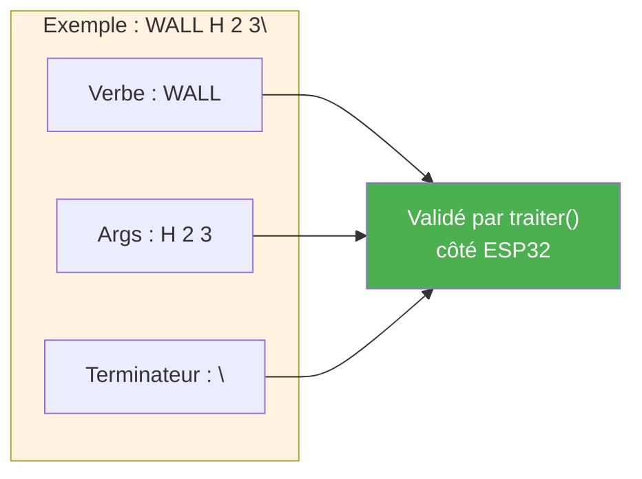
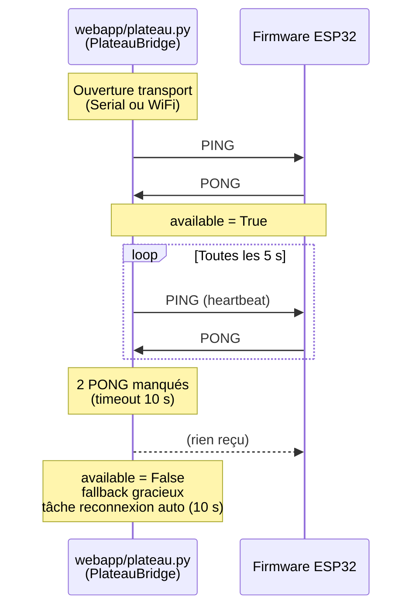
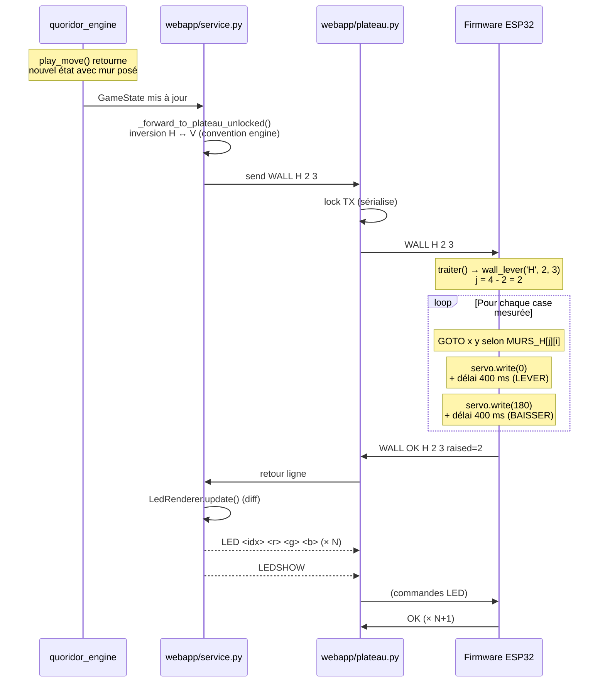
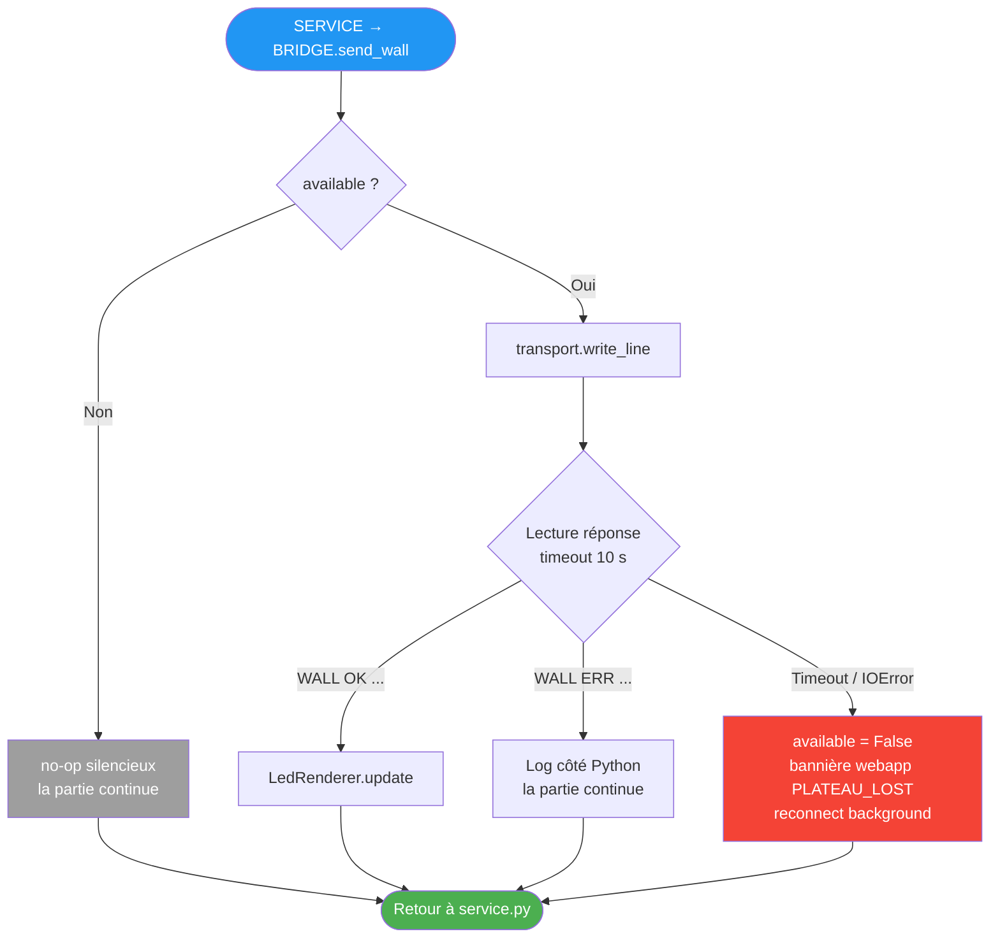

# Protocole de communication Mac ↔ ESP32

Ce document détaille le **protocole texte ligne par ligne** qui sert
d'interface entre le Mac (Python, webapp + moteur de jeu) et l'ESP32
(firmware Arduino C++). Il est **identique mot pour mot** sur les deux
transports physiques disponibles :

- **USB-série 115200 bauds** (mode développement, câble USB-C)
- **Wi-Fi TCP `192.168.4.1:3333`** (mode démo, AP `Quoridor-ESP32`)

Pour la documentation textuelle complète des commandes, voir
[`../07_protocole.md`](../07_protocole.md).

Pour l'historique (l'ancien protocole **Plan 2** avec CRC-16 + handshake
HELLO/HELLO_ACK + codes NACK est archivé sous
[`archive/pre-2026-05-20/06_protocole_uart.md`](archive/pre-2026-05-20/06_protocole_uart.md)),
voir [`../decisions.md`](../decisions.md).

---

## Format de message

Texte brut, une commande par ligne, terminée par `\n` (LF). UTF-8.
Pas de framing binaire, pas de CRC, pas de séquencement applicatif.
Le canal local (USB ou Wi-Fi AP) est supposé fiable.



---

## Catalogue des commandes Mac → ESP32

| Commande | Réponse | Usage |
|---|---|---|
| `PING` | `PONG` | Handshake initial, détection de présence |
| `HOME` | (logs verbeux) | Homing CoreXY, remise à zéro de la position |
| `WALL <H\|V> <row> <col>` | `WALL OK ... raised=<n>` ou `WALL ERR <raison>` | Lève un mur Quoridor |
| `GOTO <x> <y>` | `OK` ou `ERR <msg>` | Déplacement absolu (debug) |
| `LEVER` / `BAISSER` | `OK` | Servo 0° / 180° (debug) |
| `LED <idx> <r> <g> <b>` | `OK` ou `ERR <msg>` | Met à jour un pixel dans le buffer |
| `LEDSHOW` | `OK` | Push atomique du buffer vers la strip |
| `LEDCLEAR` | `OK` | Buffer à zéro + push |
| `LEDBRIGHT <0..255>` | `OK` ou `ERR <msg>` | Modifie la luminosité globale |

---

## Cycle de handshake et heartbeat

À l'ouverture du transport, la webapp tente un `PING` (timeout 5 s,
polling 0,5 s). Si `PONG` arrive, le pont devient actif. En partie, un
**heartbeat applicatif** émet un `PING` toutes les 5 secondes.



> **Pas de session formelle** : il n'y a pas de phase d'établissement
> structurée comme dans l'ancien Plan 2. Le `PING` peut être renvoyé à
> tout moment. Le firmware n'a aucun état de connexion à maintenir côté
> protocole (au sens applicatif).

---

## Cycle d'une pose de mur

Quand un joueur (humain ou IA) pose un mur valide, la webapp transmet la
commande `WALL` à l'ESP32, qui enchaîne les actions physiques.



> **`raised=<n>`** : nombre de positions physiques effectivement levées
> (0, 1 ou 2). Les positions non mesurées (`_NA` dans `MURS_H`/`MURS_V`)
> sont sautées sans erreur. Sur les 60 positions du plateau, 18 sont
> mesurées au 2026-05-20.

---

## Gestion des erreurs côté Mac

Le bridge se désactive (`available = False`) à la première erreur de
transport pendant une commande. Les forwards suivants deviennent des
**no-ops silencieux** (la partie continue, sans miroir physique). Une
tâche de reconnexion auto retente `transport.open()` toutes les 10 s.



> **Pas de retry automatique** : volontairement, la webapp ne re-tente
> jamais la même commande. La règle est : exécuter au plus une fois.
> En cas d'erreur, l'opérateur humain peut bascule manuellement entre
> les transports via `POST /api/transport/switch`.

---

## Bascule entre les deux transports

Le transport actif est piloté par la variable d'environnement
`QUORIDOR_TRANSPORT` (`wifi`, `serial`, `none`). Une route HTTP permet
de basculer à chaud sans redémarrer la webapp.

```mermaid
flowchart LR
    START(["Démarrage webapp"]) --> ENV{QUORIDOR_TRANSPORT}

    ENV -->|wifi (défaut)| WIFI[WiFiTransport<br/>TCP 192.168.4.1:3333]
    ENV -->|serial| SERIAL[SerialTransport<br/>/dev/cu.usbserial-*]
    ENV -->|none| NULL[NullTransport<br/>no-ops]

    WIFI --> RUN[Boucle webapp]
    SERIAL --> RUN
    NULL --> RUN

    RUN --> SWITCH{POST<br/>/api/transport/switch}
    SWITCH -->|"wifi"| WIFI
    SWITCH -->|"serial"| SERIAL
    SWITCH -->|"none"| NULL

    style WIFI fill:#FF9800,color:#fff
    style SERIAL fill:#4CAF50,color:#fff
    style NULL fill:#9E9E9E,color:#fff
```

> **Si l'ouverture du transport échoue au démarrage**, la webapp démarre
> quand même avec `NullTransport` actif et une bannière dégradée. Les
> boutons UI "Réessayer en USB" / "Réessayer en Wi-Fi" déclenchent la
> route `switch`.

---

## Pourquoi ce protocole et pas l'ancien Plan 2

Voir l'entrée **2026-05-20** dans [`../decisions.md`](../decisions.md).
Résumé :

- Canal local fiable → pas besoin de CRC ni de séquencement
- Lisibilité directe au moniteur série pour le debug
- Identique sur USB et Wi-Fi → une seule logique côté firmware (`Stream*`)
- Évolutif sans recompilation, juste ajout de cas dans `traiter()`
- Moins de code à maintenir des deux côtés
