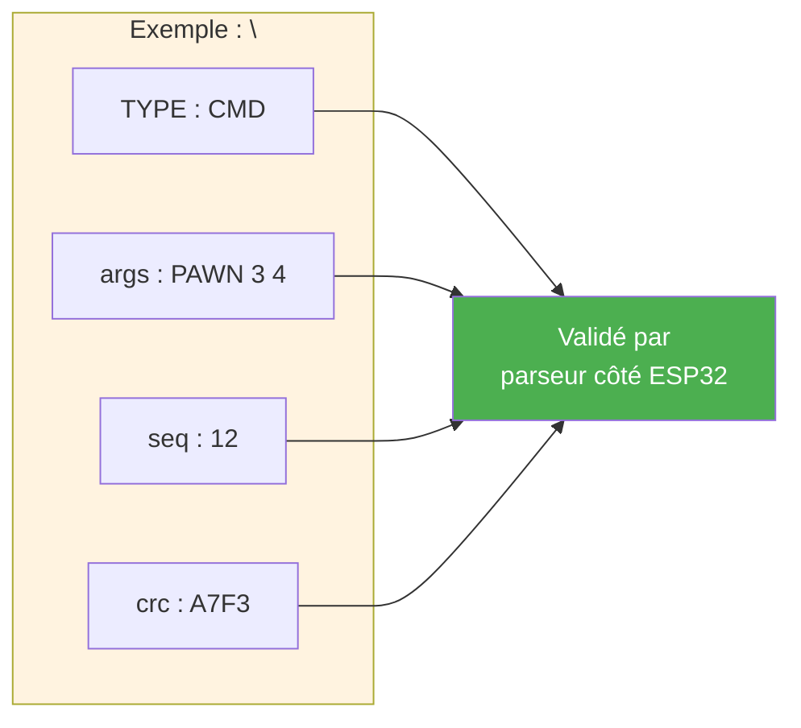
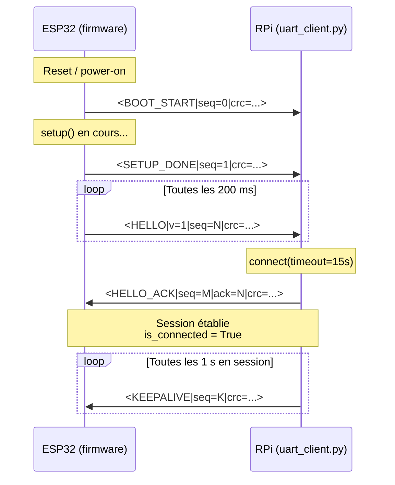
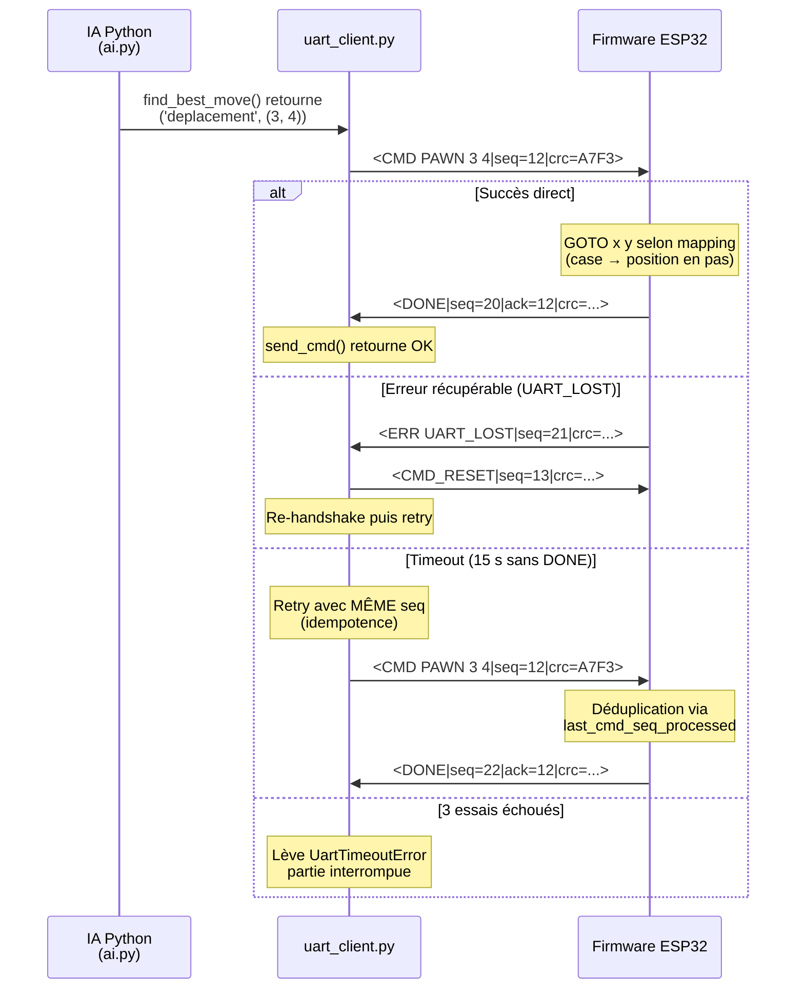
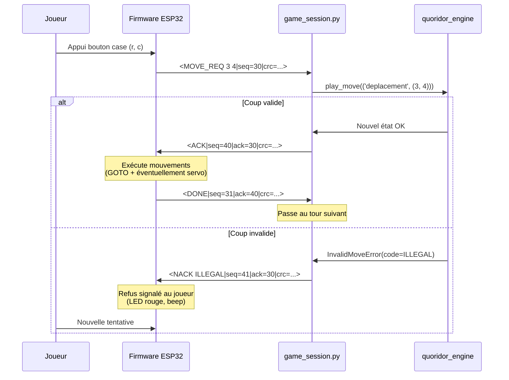
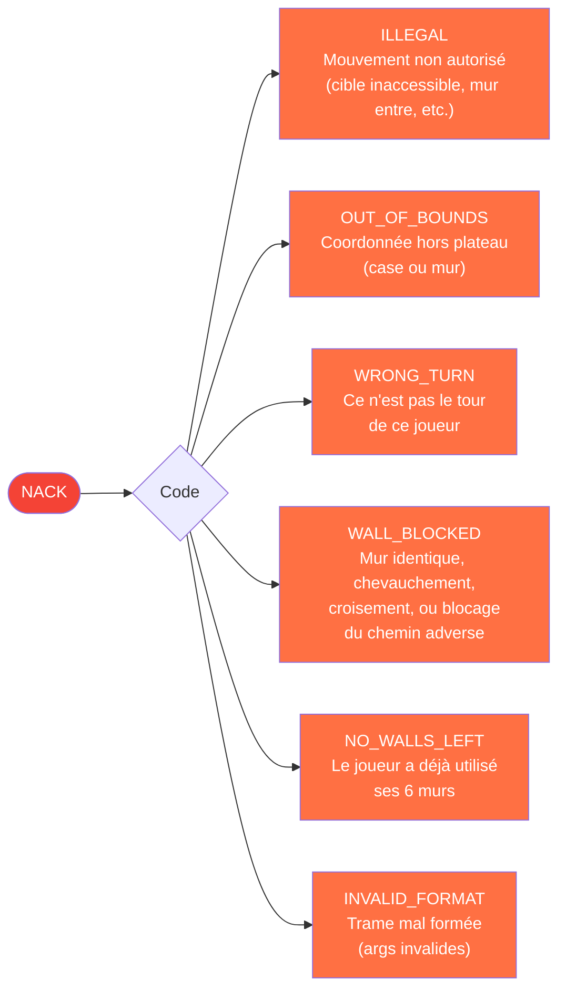
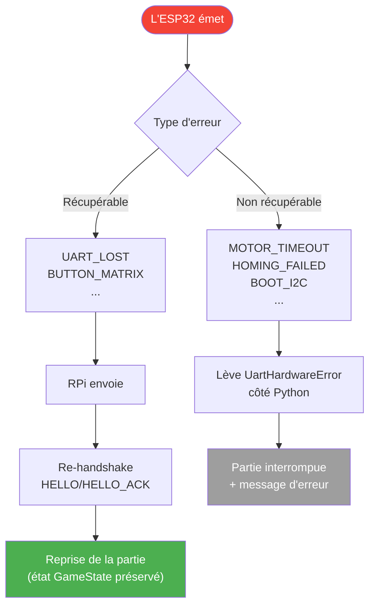
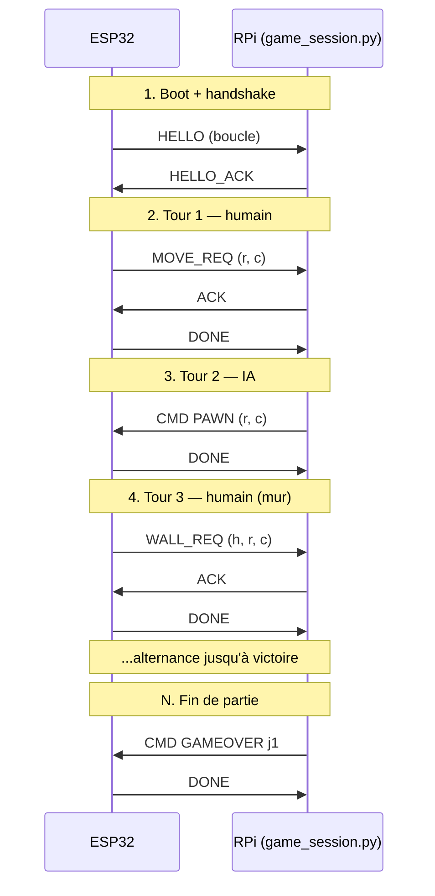

# Protocole de communication UART RPi ↔ ESP32

Ce document détaille le **protocole UART Plan 2** qui sert d'interface entre le Raspberry Pi (moteur de jeu Python) et l'ESP32 (firmware hardware). Format de trame texte avec CRC-16, séquencement, retry et codes d'erreur typés.

Sources : `quoridor_engine/uart_client.py` (côté RPi), spec dans `docs/06_protocole_uart.md`.

---

## Format de trame

Toutes les trames suivent le même schéma textuel, terminé par un saut de ligne :

```
<TYPE [args]|seq=N[|ack=M][|v=K]|crc=XXXX>\n
```

- **TYPE** : verbe de la trame (HELLO, ACK, NACK, CMD, DONE, MOVE_REQ, WALL_REQ, ERR, KEEPALIVE...)
- **args** : arguments dépendant du type (positions, codes d'erreur, etc.)
- **seq=N** : numéro de séquence de l'émetteur (mod 256)
- **ack=M** : numéro de séquence de la trame à laquelle on répond (optionnel)
- **v=K** : version du protocole (uniquement dans HELLO/HELLO_ACK)
- **crc=XXXX** : CRC-16 CCITT-FALSE (polynôme 0x1021, init 0xFFFF) sur tout le contenu **avant** `|crc=`



---

## Handshake d'établissement de session

Au démarrage de l'ESP32, un handshake confirme que les deux côtés parlent le même protocole. Tant que le handshake n'a pas réussi, aucune partie ne peut commencer.



> Le HELLO_ACK doit arriver avant **15 secondes**, sinon `uart_client.connect()` lève `UartTimeoutError` et la partie ne démarre pas.

---

## Cycle d'un coup IA (RPi → ESP32)

Quand c'est le tour de l'IA, le RPi calcule le coup en Python puis envoie une commande à l'ESP32, qui exécute physiquement (déplacement chariot + servo si mur). L'ESP32 confirme par DONE.



> **Idempotence** : sur retry, le RPi conserve le même `seq`. L'ESP32 garde en mémoire le dernier `seq` traité, donc si la trame revient en double, il ne ré-exécute pas le coup et renvoie juste le DONE caché.

---

## Cycle d'un coup humain via plateau physique

Le joueur appuie sur des boutons du plateau pour signaler son intention. L'ESP32 envoie une **requête** (MOVE_REQ ou WALL_REQ), et le RPi répond ACK (coup valide, va l'exécuter) ou NACK avec un code d'erreur typé.



---

## Catalogue des codes NACK

Le moteur Python lève une exception `InvalidMoveError(message, code: NackCode)` qui est convertie en NACK textuel sur l'UART. Les codes sont alignés exactement entre Python et C++.



---

## Gestion des erreurs et déconnexions

Le protocole distingue deux familles d'erreurs : récupérables (un reset suffit) et non-récupérables (partie interrompue).



> **Limitation connue (Plan P11 à venir)** : après un reset ESP32, la position physique des pions sur le plateau est perdue tant que la machine n'a pas refait son HOME. La re-synchronisation complète sera ajoutée dans une phase ultérieure.

---

## Vue d'ensemble du dialogue typique d'une partie



---

> **Principe clé** : tous les échanges sont **typés** (verbe explicite), **vérifiés** (CRC-16), **séquencés** (anti-doublon) et **acquittés** (corrélation requête/réponse). Cette discipline garantit que le moteur de jeu Python reste la **seule source de vérité** sur les règles, et que l'ESP32 ne fait qu'exécuter ce qui lui est explicitement demandé.
