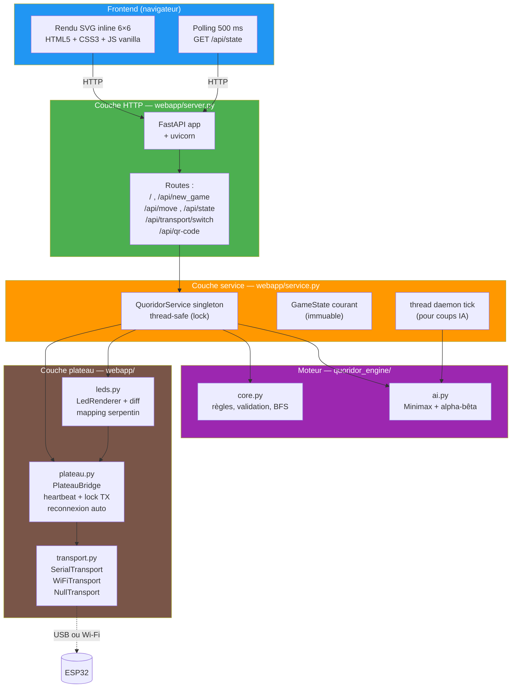
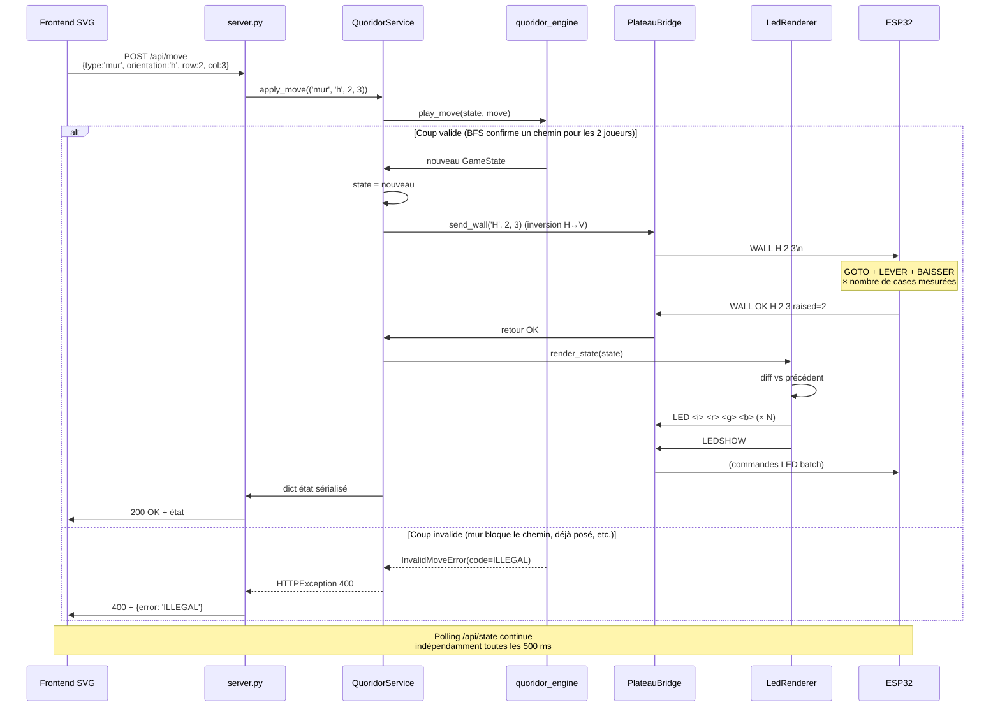
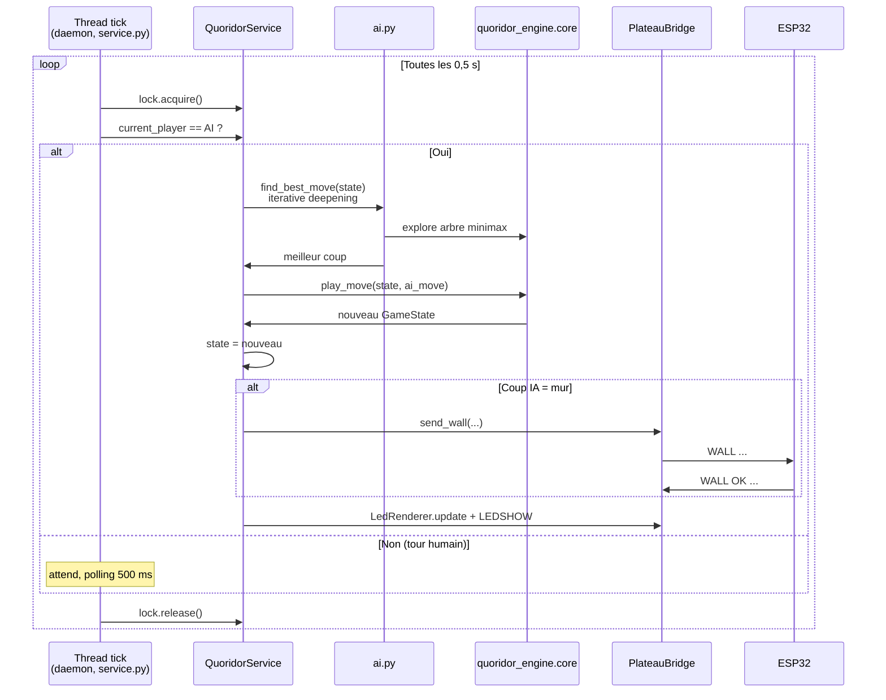

# Webapp — couches HTTP et flux de jeu

La webapp est servie par **FastAPI** + **uvicorn** sur le port 8000. Elle
tourne sur le Mac et est accessible depuis n'importe quel navigateur sur
le même réseau (Safari iPhone, Chrome sur le Mac, etc.). Frontend HTML5 +
SVG inline + JS vanilla — zéro framework, zéro étape de build.

Pour l'historique de l'architecture serveur côté **RPi** (avant le pivot
2026-05-20), voir
[`archive/pre-2026-05-20/07_webapp_flux.md`](archive/pre-2026-05-20/07_webapp_flux.md).

---

## Architecture en couches



---

## Routes principales

| Méthode | Route | Rôle |
|---|---|---|
| `GET` | `/` | Sert le fichier HTML principal |
| `GET` | `/api/state` | Retourne l'état courant (polling 500 ms) |
| `POST` | `/api/new_game` | Démarre une nouvelle partie (mode + difficulté) |
| `POST` | `/api/move` | Soumet un coup (déplacement ou mur) |
| `POST` | `/api/reset` | Remet le plateau à zéro |
| `POST` | `/api/transport/switch` | Bascule à chaud entre `wifi`, `serial`, `none` |
| `GET` | `/api/qr-code` | Retourne un QR code SVG vers l'URL de la webapp |
| `GET` | `/api/status` | Statut du transport (état, dernier ping, erreurs) |

---

## Flux d'un coup humain (pose de mur, mode démo Wi-Fi)



---

## Flux d'un coup IA (tick thread)



---

## Modes d'exécution

```mermaid
flowchart LR
    START(["Démarrage webapp"]) --> ENV{QUORIDOR_TRANSPORT}

    ENV -->|none| AUTONOMOUS[NullTransport<br/>jeu 100 % logiciel<br/>= démo P0]
    ENV -->|serial| HYBRID_USB[SerialTransport<br/>câble USB-C<br/>= mode dev]
    ENV -->|wifi (défaut)| HYBRID_WIFI[WiFiTransport<br/>AP Quoridor-ESP32<br/>= mode démo]

    AUTONOMOUS --> NO_MIRROR[Murs posés à l'écran<br/>aucun écho physique]
    HYBRID_USB --> MIRROR[Webapp pilote le plateau]
    HYBRID_WIFI --> MIRROR

    MIRROR --> CRASH{Erreur transport<br/>en cours ?}
    CRASH -->|Oui| FALLBACK[available = False<br/>bannière PLATEAU_LOST<br/>reconnexion auto background]
    CRASH -->|Non| OK[Partie suit son cours]
    FALLBACK --> OK

    style AUTONOMOUS fill:#9E9E9E,color:#fff
    style HYBRID_USB fill:#4CAF50,color:#fff
    style HYBRID_WIFI fill:#FF9800,color:#fff
    style FALLBACK fill:#f44336,color:#fff
```

> **Bascule à chaud** : `POST /api/transport/switch` permet de basculer
> `wifi` ↔ `serial` ↔ `none` sans redémarrer la webapp. Pratique pendant
> la démo si le Wi-Fi devient instable.

---

## Frontend

Un seul fichier HTML + un fichier CSS + un fichier JS vanilla. Rendu
**SVG inline** du plateau 6×6 :

- **Clic sur une case** : envoie `/api/move` avec `{type:'deplacement', row, col}`
- **Clic sur une arête inter-cases** : envoie `/api/move` avec `{type:'mur', orientation, row, col}`
- **Coups légaux pré-affichés** en cyan dim (sur le plateau LED aussi, depuis 2026-05-21)
- **Bannières de statut** : transport actif, erreurs, mode dégradé
- **Polling 500 ms** sur `/api/state` met à jour le plateau pour refléter
  les coups IA jouée en arrière-plan
- **QR code intégré** au démarrage (route `/api/qr-code`) pour partager
  l'URL avec un smartphone

Choix volontaire : zéro framework, zéro build. Toute la logique frontale
tient dans ~300 lignes JS, lisible par n'importe quel développeur.

---

## Tests

| Fichier | Couverture |
|---|---|
| `tests/webapp/test_api.py` | Routes FastAPI (client httpx) |
| `tests/webapp/test_service.py` | Couche service, intégration moteur + transport mocké |
| `tests/webapp/test_transport.py` | Implémentations Serial / WiFi / Null |
| `tests/webapp/test_plateau.py` | `PlateauBridge` : heartbeat, lock, reconnexion |
| `tests/webapp/test_leds.py` | `LedRenderer` : mapping serpentin, diff |
| `tests/webapp/test_schemas.py` | Modèles Pydantic |
| `tests/devkit/*.py` | Tests requérant un ESP32 branché (markers `devkit_serial`, `devkit_wifi`) |

Aucun test webapp standard ne nécessite un ESP32 physique. Les tests
hardware sont isolés via marqueurs pytest. Voir
[`../08_tests.md`](../08_tests.md).
