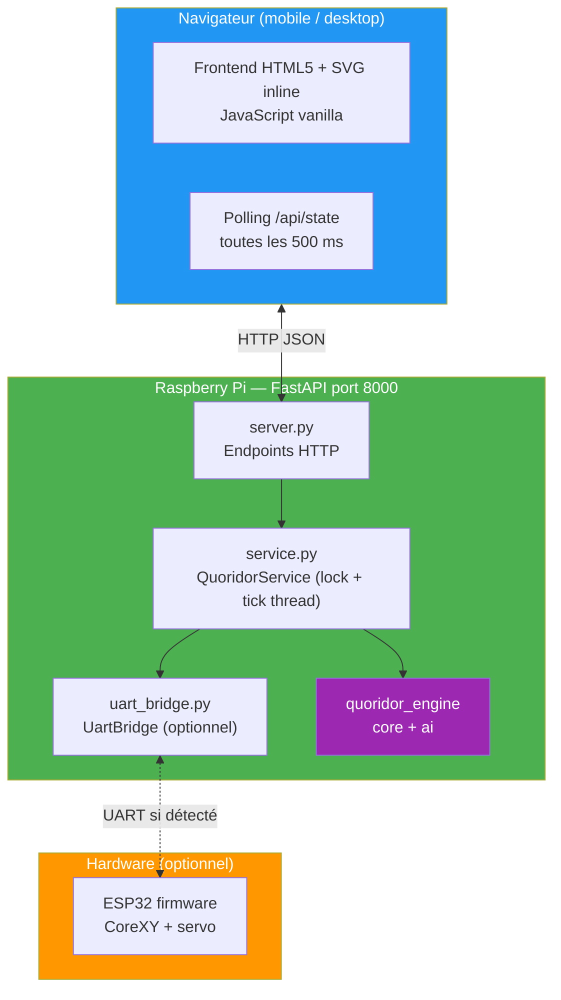
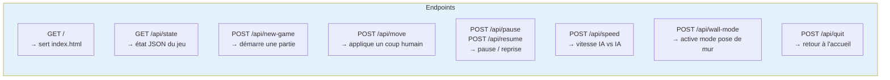
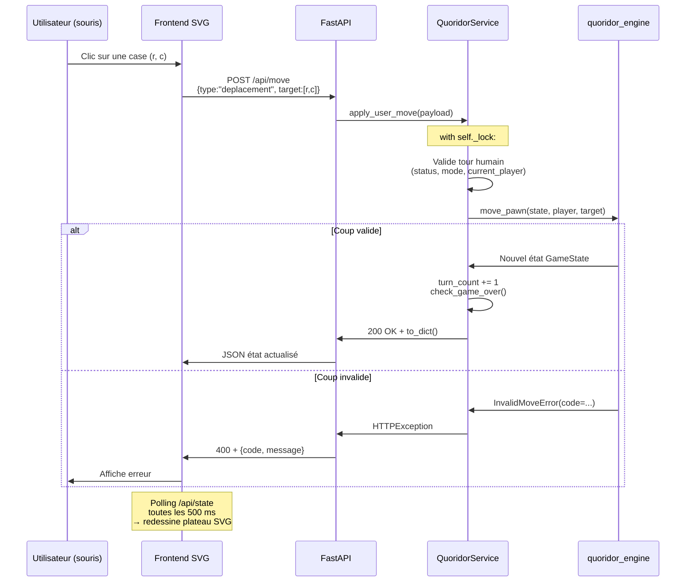
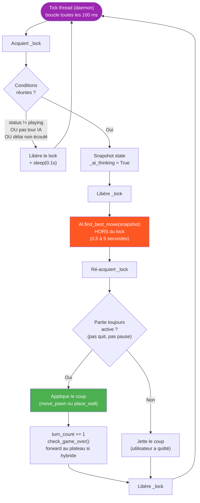
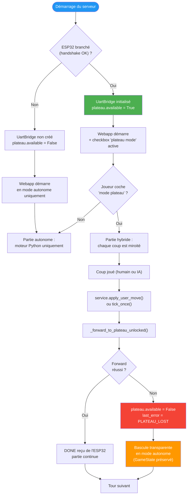
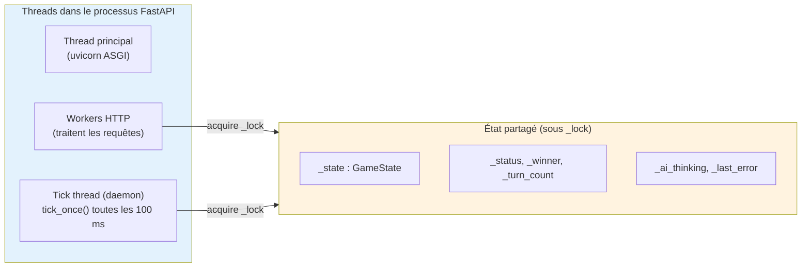

# Webapp de démonstration — architecture et flux

Ce document détaille la webapp FastAPI développée comme mode de démonstration principal (suite à l'abandon de la PCB v2). Elle fonctionne en **mode autonome** par défaut, ou en **mode hybride** si un ESP32 est détecté au boot.

Sources : `webapp/server.py`, `webapp/service.py`, `webapp/uart_bridge.py`, `webapp/schemas.py`, `webapp/static/`.

---

## Architecture en trois couches

---

## Endpoints HTTP exposés

Tous les endpoints retournent un JSON sérialisé par `QuoridorService.to_dict()` contenant : mode, difficulté, statut, joueurs, murs, gagnant, état plateau, dernière erreur.

---

## Flux d'un coup humain (mode autonome)

---

## Flux d'un coup IA via le tick thread

L'IA tourne dans un **thread daemon séparé** qui boucle toutes les 100 ms. Point clé : la réflexion IA (qui peut prendre 0,5 à 5 secondes selon la difficulté) est exécutée **hors du lock** pour ne pas bloquer les requêtes HTTP.

> **Pourquoi sortir du lock** ? Une requête `GET /api/state` doit retourner sous 100 ms pour que le polling reste fluide. Si l'IA pensait dans le lock, l'interface serait gelée pendant toute sa réflexion.

---

## Mode hybride : webapp + plateau physique

Si l'ESP32 est branché au boot, `UartBridge` essaie le handshake. Si ça réussit, l'option **« mode plateau »** apparaît dans la webapp. Les coups joués dans le navigateur sont alors miroités physiquement.

> **Fallback gracieux** : aucune tentative de reconnexion automatique. Une fois le plateau perdu, la partie continue côté logiciel sans interruption — le joueur est juste notifié dans l'interface.

---

## Modèle de threading

**Règles** :
1. Toutes les mutations passent par `self._lock`.
2. La réflexion IA (la seule opération longue) sort du lock avec un snapshot.
3. Le tick thread est daemon : il meurt avec le processus, pas besoin de stop explicite.

---

> **Principe clé** : la webapp est conçue pour être **toujours fonctionnelle** — sans hardware, avec hardware, et même si le hardware se déconnecte en pleine partie. C'est ce qui en fait un mode de démonstration robuste pour la présentation finale.
