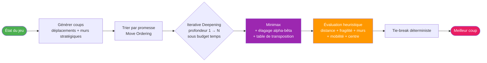

# Logigramme IA — version slide

Version condensée du fonctionnement de l'IA pour une slide de présentation (tient sur 1/4 de page).

```mermaid
flowchart LR
    IN([État du jeu]) --> GEN[Générer coups<br/>déplacements + murs stratégiques]
    GEN --> SORT[Trier par promesse<br/>Move Ordering]
    SORT --> ID{Iterative Deepening<br/>profondeur 1 → N<br/>sous budget temps}
    ID --> MM[Minimax<br/>+ élagage alpha-bêta<br/>+ table de transposition]
    MM --> EVAL[Évaluation heuristique<br/>distance + fragilité + murs<br/>+ mobilité + centre]
    EVAL --> TB[Tie-break déterministe]
    TB --> OUT([Meilleur coup])

    style IN fill:#4CAF50,color:#fff
    style OUT fill:#E91E63,color:#fff
    style MM fill:#9C27B0,color:#fff
    style EVAL fill:#FF9800,color:#fff
```
