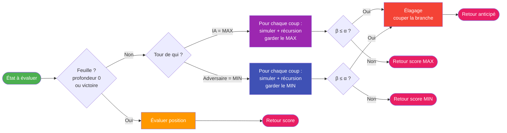
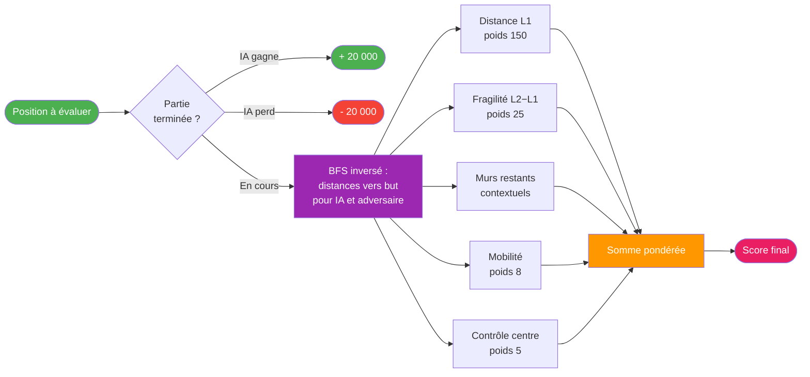

# Logigrammes IA détaillés — slides

Deux logigrammes complémentaires de la vue d'ensemble, format paysage compact pour slides.

## 1 — Minimax avec élagage alpha-bêta

## 2 — Fonction d'évaluation heuristique

