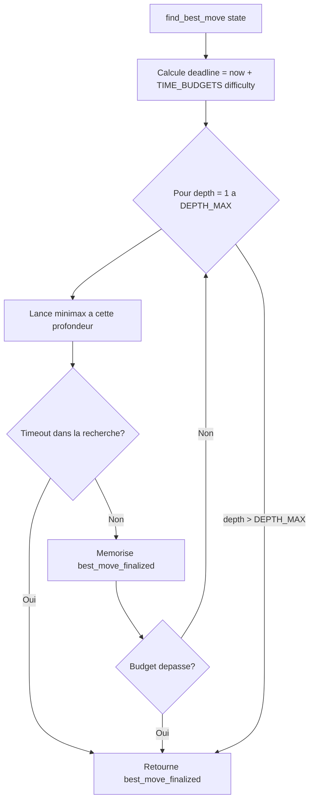

# Renforcement IA Quoridor Implementation Plan

> **For agentic workers:** REQUIRED SUB-SKILL: Use superpowers:subagent-driven-development (recommended) or superpowers:executing-plans to implement this plan task-by-task. Steps use checkbox (`- [ ]`) syntax for tracking.

**Goal:** Éliminer les coups bizarres de l'IA Quoridor (random.choice, random.shuffle, mate-in-N) et la renforcer via iterative deepening déterministe sous budget temps, sans casser l'API publique ni les 278 tests existants.

**Architecture:** L'IA passe de "minimax à profondeur fixe avec aléatoire" à "minimax avec iterative deepening sous budget temps + tie-break déterministe". La classe `AI` et ses méthodes publiques (`__init__`, `find_best_move`, `clear_cache`) gardent leurs signatures. Toutes les modifications sont internes à `quoridor_engine/ai.py`.

**Tech Stack:** Python 3, pytest, dataclasses (existant). Pas de nouvelle dépendance.

**Spec source:** [docs/superpowers/specs/2026-05-19-renforcement-ia-quoridor-design.md](../specs/2026-05-19-renforcement-ia-quoridor-design.md)

---

## File Structure

| Fichier | Type | Responsabilité |
|---|---|---|
| `quoridor_engine/ai.py` | Modifié | Toute la logique IA. Refactoring interne sans casser l'API publique. |
| `tests/test_ai.py` | Modifié | 3 tests existants refondus, 4 classes de tests ajoutées. |
| `docs/04_ia.md` | Modifié | Section "Niveaux de difficulté" et "Optimisations" mises à jour. |
| `docs/flowcharts/02_logique_ia.md` | Modifié | Diagramme de flux adapté pour iterative deepening. |
| `docs/jeu/comprendre_le_code.md` | Modifié | Section IA pédagogique mise à jour. |

Pas de nouveau fichier créé. Pas de fichier supprimé.

---

## Task 1 : Préparation — Constantes et nettoyage

**Files:**
- Modify: `quoridor_engine/ai.py:50-72` (imports) et `:420` (print) et après les imports (constantes)
- Test: `tests/test_ai.py` (nouvelle classe `TestModuleConstants`)

**Contexte:** Avant les changements algorithmiques, on extrait les valeurs magiques en constantes du module et on supprime le `print()` parasite du constructeur.

- [ ] **Step 1.1: Écrire les tests des constantes (TDD rouge)**

Ajouter en bas de `tests/test_ai.py`, avant `if __name__ == '__main__':` :

```python
class TestModuleConstants:
    """Tests des constantes exposées en haut du module ai.py."""

    def test_time_budgets_defined(self):
        """TIME_BUDGETS expose les 3 niveaux."""
        from quoridor_engine import ai
        assert hasattr(ai, 'TIME_BUDGETS')
        assert set(ai.TIME_BUDGETS.keys()) == {'facile', 'normal', 'difficile'}

    def test_time_budgets_ordered(self):
        """facile < normal < difficile en budget temps."""
        from quoridor_engine import ai
        budgets = ai.TIME_BUDGETS
        assert budgets['facile'] < budgets['normal'] < budgets['difficile']
        # Valeurs initiales raisonnables, à calibrer
        assert 0.1 <= budgets['facile'] <= 30.0
        assert 0.1 <= budgets['difficile'] <= 30.0

    def test_depth_max_defined(self):
        """DEPTH_MAX est défini et raisonnable."""
        from quoridor_engine import ai
        assert hasattr(ai, 'DEPTH_MAX')
        assert 5 <= ai.DEPTH_MAX <= 20

    def test_max_wall_candidates_defined(self):
        """MAX_WALL_CANDIDATES est défini et supérieur à 20."""
        from quoridor_engine import ai
        assert hasattr(ai, 'MAX_WALL_CANDIDATES')
        assert ai.MAX_WALL_CANDIDATES >= 20

    def test_win_score_defined(self):
        """WIN_SCORE est défini à 20000."""
        from quoridor_engine import ai
        assert hasattr(ai, 'WIN_SCORE')
        assert ai.WIN_SCORE == 20000
```

- [ ] **Step 1.2: Lancer les tests, vérifier qu'ils échouent**

```bash
pytest tests/test_ai.py::TestModuleConstants -v
```

Expected: 5 FAIL avec `AttributeError: module 'quoridor_engine.ai' has no attribute 'TIME_BUDGETS'`

- [ ] **Step 1.3: Ajouter les constantes en haut de `quoridor_engine/ai.py`**

Après le bloc d'imports existants (après ligne 71), ajouter :

```python
# =============================================================================
# CONSTANTES DE CONFIGURATION
# =============================================================================

# Budget temps par niveau de difficulté (secondes). Valeurs initiales
# raisonnables, à calibrer empiriquement après jeu réel. Voir Task 7.
TIME_BUDGETS = {
    'facile':    0.5,
    'normal':    2.0,
    'difficile': 5.0,
}

# Profondeur maximale absolue de l'iterative deepening. Garde-fou contre
# explosion mémoire sur positions triviales avec budget large. En pratique
# on n'y arrive jamais sur plateau 6x6.
DEPTH_MAX = 12

# Nombre maximum de murs candidats considérés par tour. Relevé de 20 à 30
# depuis que le tri par priorité remplace le shuffle aléatoire.
MAX_WALL_CANDIDATES = 30

# Score absolu d'une victoire/défaite (avant ajustement mate-in-N).
WIN_SCORE = 20000
```

- [ ] **Step 1.4: Supprimer le print() dans `__init__`**

Dans `quoridor_engine/ai.py`, supprimer la ligne 420 (`print(f"IA initialisée pour le joueur ...")`) entièrement.

- [ ] **Step 1.5: Lancer les tests, vérifier qu'ils passent**

```bash
pytest tests/test_ai.py::TestModuleConstants -v
```

Expected: 5 PASS

Lancer aussi la suite IA pour non-régression :

```bash
pytest tests/test_ai.py -v
```

Expected: tous les tests passent (le print supprimé n'est pas testé).

- [ ] **Step 1.6: Commit**

```bash
git add quoridor_engine/ai.py tests/test_ai.py
git commit -m "$(cat <<'EOF'
refactor(ia): expose constantes TIME_BUDGETS, DEPTH_MAX, MAX_WALL_CANDIDATES, WIN_SCORE

Prepare le refactor iterative deepening en extrayant les valeurs magiques
en constantes du module. Supprime aussi le print() parasite du constructeur
qui polluait stdout en tests et webapp.

Co-Authored-By: Claude Opus 4.7 (1M context) <noreply@anthropic.com>
EOF
)"
```

---

## Task 2 : Tri des murs candidats par priorité (suppression du shuffle aléatoire)

**Files:**
- Modify: `quoridor_engine/ai.py:718-779` (`_get_strategic_walls`)
- Test: `tests/test_ai.py` (nouvelle classe `TestWallCandidates`)

**Contexte:** Actuellement les murs candidats sont shuffled puis coupés à 20 → peut éjecter aléatoirement des murs stratégiques. On remplace par un tri déterministe par priorité (proximité au plus proche pion) puis coupe à `MAX_WALL_CANDIDATES`.

- [ ] **Step 2.1: Écrire les tests (TDD rouge)**

Ajouter dans `tests/test_ai.py`, après `TestModuleConstants` :

```python
class TestWallCandidates:
    """Tests du tri et du cap des murs candidats."""

    def test_strategic_walls_deterministic(self):
        """Deux appels successifs retournent la même liste de murs."""
        game = create_new_game()
        ia = AI(PLAYER_ONE, difficulty='facile')
        walls1 = ia._get_strategic_walls(game, PLAYER_ONE)
        walls2 = ia._get_strategic_walls(game, PLAYER_ONE)
        assert walls1 == walls2

    def test_strategic_walls_capped_at_max(self):
        """Le nombre de murs retournés ne dépasse pas MAX_WALL_CANDIDATES."""
        from quoridor_engine import ai
        game = create_new_game()
        ia = AI(PLAYER_ONE, difficulty='facile')
        walls = ia._get_strategic_walls(game, PLAYER_ONE)
        assert len(walls) <= ai.MAX_WALL_CANDIDATES

    def test_wall_near_opponent_is_preserved(self):
        """Un mur immédiatement adjacent à l'adversaire est dans les candidats."""
        # J2 est en (3, 3), un mur horizontal en (3, 2) est juste devant lui
        game = GameState(
            player_positions={PLAYER_ONE: (0, 3), PLAYER_TWO: (3, 3)},
            walls=frozenset(),
            player_walls={PLAYER_ONE: 6, PLAYER_TWO: 6},
            current_player=PLAYER_ONE
        )
        ia = AI(PLAYER_ONE, difficulty='facile')
        walls = ia._get_strategic_walls(game, PLAYER_ONE)
        # Le mur ('h', 3, 2, 2) bloque le passage de J2 vers (4, ...)
        critical_wall = ('h', 3, 2, 2)
        assert critical_wall in walls, f"Mur critique {critical_wall} eject. Murs retournes: {walls}"
```

- [ ] **Step 2.2: Lancer les tests, vérifier qu'ils échouent**

```bash
pytest tests/test_ai.py::TestWallCandidates -v
```

Expected:
- `test_strategic_walls_deterministic` : FAIL probable (shuffle aléatoire)
- `test_strategic_walls_capped_at_max` : peut PASS si MAX_WALL_CANDIDATES > 20, mais on le revérifie
- `test_wall_near_opponent_is_preserved` : FAIL probable selon le shuffle

- [ ] **Step 2.3: Ajouter la fonction `_wall_priority` dans `quoridor_engine/ai.py`**

Avant la classe `AI` (après ligne 327 environ, à côté des autres fonctions utilitaires) :

```python
def _wall_priority(wall: Tuple, opp_pos: Coord, my_pos: Coord) -> int:
    """
    Calcule un score de priorité pour le tri des murs candidats.

    PRINCIPE :
    ----------
    Un mur est d'autant plus prioritaire qu'il est PROCHE d'un des deux pions.
    Distance Manhattan inversée (plus c'est proche, plus le score est haut).

    Pondération : on privilégie les murs près de l'ADVERSAIRE (pour le bloquer)
    sur les murs près de soi (pour protéger son chemin).

    Args:
        wall: (orientation, row, col, length)
        opp_pos: position de l'adversaire
        my_pos: position du joueur courant

    Returns:
        Score entier. Plus grand = plus prioritaire.
    """
    wall_r, wall_c = wall[1], wall[2]
    dist_to_opp = abs(wall_r - opp_pos[0]) + abs(wall_c - opp_pos[1])
    dist_to_me = abs(wall_r - my_pos[0]) + abs(wall_c - my_pos[1])
    # Priorité décroissante avec la distance. Bonus si proche de l'adversaire.
    return -(dist_to_opp * 2 + dist_to_me)
```

- [ ] **Step 2.4: Modifier `_get_strategic_walls` pour utiliser ce tri**

Dans `quoridor_engine/ai.py`, remplacer les 4 dernières lignes de `_get_strategic_walls` (lignes 776-779) :

```python
# AVANT
strategic_walls = list(strategic_walls)
random.shuffle(strategic_walls)
return strategic_walls[:max_walls]
```

par :

```python
# APRES
strategic_walls = list(strategic_walls)
strategic_walls.sort(
    key=lambda w: _wall_priority(w, opp_pos, my_pos),
    reverse=True  # plus grand score d'abord
)
return strategic_walls[:max_walls]
```

Et changer le default du paramètre `max_walls` de la signature (ligne 718) :

```python
def _get_strategic_walls(self, state: GameState, player: str, max_walls: int = None) -> List[Tuple]:
```

Puis ajouter au début de la fonction (après la docstring) :

```python
if max_walls is None:
    max_walls = MAX_WALL_CANDIDATES
```

Mettre à jour la docstring : remplacer "20" par "MAX_WALL_CANDIDATES (30 par defaut)".

- [ ] **Step 2.5: Lancer les tests, vérifier qu'ils passent**

```bash
pytest tests/test_ai.py::TestWallCandidates -v
```

Expected: 3 PASS

Vérifier non-régression :

```bash
pytest tests/test_ai.py -v
```

Expected: tous les tests passent.

- [ ] **Step 2.6: Commit**

```bash
git add quoridor_engine/ai.py tests/test_ai.py
git commit -m "$(cat <<'EOF'
fix(ia): remplace random.shuffle des murs par tri par priorite deterministe

Eliminait aleatoirement des murs strategiques avant le cap. Nouveau tri
par distance Manhattan inverse (proximite aux pions) garantit qu'un mur
adjacent a l'adversaire est toujours considere. Cap releve a 30 candidats.

Co-Authored-By: Claude Opus 4.7 (1M context) <noreply@anthropic.com>
EOF
)"
```

---

## Task 3 : Tie-break déterministe (suppression de random.choice)

**Files:**
- Modify: `quoridor_engine/ai.py:1057-1135` (`find_best_move`)
- Modify: `quoridor_engine/ai.py:1128` (fallback random)
- Test: `tests/test_ai.py` (nouvelle classe `TestTieBreak`)

**Contexte:** Le `random.choice` final sur les coups à score égal est la source principale des coups bizarres. On le remplace par une cascade déterministe de critères.

- [ ] **Step 3.1: Écrire les tests (TDD rouge)**

Ajouter dans `tests/test_ai.py` :

```python
class TestTieBreak:
    """Tests du tie-break déterministe."""

    def test_find_best_move_deterministic_facile(self):
        """Deux appels successifs en facile retournent le même coup."""
        game = create_new_game()
        ia = AI(PLAYER_TWO, difficulty='facile')
        move1 = ia.find_best_move(game, verbose=False)
        ia.clear_cache()
        move2 = ia.find_best_move(game, verbose=False)
        assert move1 == move2

    def test_find_best_move_deterministic_normal(self):
        """Deux appels successifs en normal retournent le même coup."""
        game = create_new_game()
        ia = AI(PLAYER_TWO, difficulty='normal')
        move1 = ia.find_best_move(game, verbose=False)
        ia.clear_cache()
        move2 = ia.find_best_move(game, verbose=False)
        assert move1 == move2

    def test_tie_break_prefers_advance(self):
        """À score égal, le tie-break préfère un coup qui avance vers le but."""
        # Position où J1 est en (3, 3), peut avancer (2, 3) ou reculer (4, 3)
        game = GameState(
            player_positions={PLAYER_ONE: (3, 3), PLAYER_TWO: (0, 0)},
            walls=frozenset(),
            player_walls={PLAYER_ONE: 6, PLAYER_TWO: 6},
            current_player=PLAYER_ONE
        )
        ia = AI(PLAYER_ONE, difficulty='facile')
        # Construire artificiellement deux coups à score égal
        advance_move = ('deplacement', (2, 3))
        backward_move = ('deplacement', (4, 3))
        chosen = ia._tie_break(game, [advance_move, backward_move])
        assert chosen == advance_move

    def test_tie_break_single_move_returns_it(self):
        """Tie-break avec un seul coup retourne ce coup."""
        game = create_new_game()
        ia = AI(PLAYER_ONE, difficulty='facile')
        only_move = ('deplacement', (4, 3))
        chosen = ia._tie_break(game, [only_move])
        assert chosen == only_move
```

- [ ] **Step 3.2: Lancer les tests, vérifier qu'ils échouent**

```bash
pytest tests/test_ai.py::TestTieBreak -v
```

Expected: tous FAIL :
- déterminisme : peut échouer par hasard sur 50% des positions
- `_tie_break` : `AttributeError` car la méthode n'existe pas

- [ ] **Step 3.3: Ajouter la méthode `_tie_break` dans la classe `AI`**

Avant la méthode `find_best_move` (donc avant ligne 1057), ajouter :

```python
def _tie_break(self, state: GameState, candidates: List[Move]) -> Move:
    """
    Choisit un coup parmi un ensemble de coups à score minimax égal.

    Cascade de critères (premier qui distingue tranche) :
    1. Type : déplacements considérés avant les murs (cohérent avec critère "avance")
    2. Pour les déplacements : préférer ceux qui avancent (improvement > 0)
    3. Pour les déplacements : à improvement égal, préférer la colonne centrale
    4. Pour les murs : préférer celui qui rallonge le plus l'adversaire (delta_opp)
    5. Ordre canonique (str du coup) : déterminisme strict en dernier ressort

    Implémentation : on calcule une clé tuple par coup, et on retourne le min().

    Args:
        state: état courant (pour calculer les distances)
        candidates: liste des coups à départager (au moins 1)

    Returns:
        Le coup choisi (déterministe).
    """
    if len(candidates) == 1:
        return candidates[0]

    player = state.current_player
    opponent = PLAYER_TWO if player == PLAYER_ONE else PLAYER_ONE
    current_pos = state.player_positions[player]
    distances_self = self._get_cached_distances(state, player)
    distances_opp = self._get_cached_distances(state, opponent)
    current_dist = distances_self.get(current_pos, 99)
    opp_pos = state.player_positions[opponent]
    L1_opp_before = distances_opp.get(opp_pos, 99)

    def sort_key(move: Move) -> tuple:
        """Retourne une clé pour tri ASCENDANT (plus petit = préféré)."""
        move_type, move_data = move
        if move_type == 'deplacement':
            target = move_data
            target_dist = distances_self.get(target, 99)
            improvement = current_dist - target_dist  # > 0 = avance
            center_dist = abs(target[1] - BOARD_SIZE // 2)  # plus petit = plus central
            # type=0 (déplacements avant murs)
            # advance_penalty=0 si avance, 1 sinon
            # -improvement pour que plus grand improvement → plus petite clé
            # center_dist : plus petit = mieux
            # str(move) : ordre canonique
            return (0, 0 if improvement > 0 else 1, -improvement, center_dist, 0, str(move))
        else:  # 'mur'
            wall = move_data
            try:
                temp_walls = state.walls | {wall}
                temp_state = replace(state, walls=temp_walls)
                distances_after = _get_all_distances_to_goal(temp_state, opponent)
                L1_after = distances_after.get(opp_pos, 99)
                delta_opp = L1_after - L1_opp_before  # > 0 = rallonge l'adversaire
            except Exception:
                delta_opp = 0
            # type=1 (murs après déplacements)
            # placeholders pour aligner la longueur du tuple avec celle des déplacements
            # -delta_opp pour que plus grand delta → plus petite clé
            return (1, 0, 0, 0, -delta_opp, str(move))

    return min(candidates, key=sort_key)
```

Note : `replace` est déjà importé depuis `dataclasses` au début du fichier (ligne 54), pas besoin de l'ajouter.

- [ ] **Step 3.4: Remplacer `random.choice` dans `find_best_move`**

Dans `quoridor_engine/ai.py`, modifier les lignes 1119-1121 :

```python
# AVANT
if best_moves:
    # Choisir aléatoirement parmi les coups avec le même score
    return random.choice(best_moves)
```

par :

```python
# APRES
if best_moves:
    return self._tie_break(state, best_moves)
```

- [ ] **Step 3.5: Remplacer le fallback `random.choice` aussi**

Dans `quoridor_engine/ai.py`, modifier ligne 1128 :

```python
# AVANT
if pawn_moves:
    return ('deplacement', random.choice(pawn_moves))
```

par :

```python
# APRES (déterministe : premier coup dans l'ordre lexicographique)
if pawn_moves:
    sorted_moves = sorted(pawn_moves)
    return ('deplacement', sorted_moves[0])
```

- [ ] **Step 3.6: Supprimer l'import `random` (devenu inutile)**

Après les Steps 3.4 et 3.5, plus aucun usage de `random` ne subsiste dans `quoridor_engine/ai.py` (Task 2 avait déjà retiré `random.shuffle`). Vérifier :

```bash
grep -n "random" quoridor_engine/ai.py
```

Expected: aucun match (sauf éventuellement dans des commentaires).

Si aucun match, supprimer l'import en haut du fichier :

```python
# AVANT (ligne 51)
import random

# APRES
# (ligne supprimée)
```

- [ ] **Step 3.7: Lancer les tests, vérifier qu'ils passent**

```bash
pytest tests/test_ai.py::TestTieBreak -v
```

Expected: 4 PASS

Vérifier non-régression complète :

```bash
pytest tests/test_ai.py -v
```

Expected: tous les tests passent.

- [ ] **Step 3.8: Commit**

```bash
git add quoridor_engine/ai.py tests/test_ai.py
git commit -m "$(cat <<'EOF'
fix(ia): remplace random.choice final par tie-break deterministe

Source principale des coups bizarres signales par l'utilisateur (recul de
pion, mur sans interet). Cascade 4 criteres : avance > impact mur >
distance centre > ordre canonique. Garantit determinisme strict.

Co-Authored-By: Claude Opus 4.7 (1M context) <noreply@anthropic.com>
EOF
)"
```

---

## Task 4 : Mate-in-N (préfère gagner vite, perdre tard)

**Files:**
- Modify: `quoridor_engine/ai.py:454-549` (`_evaluate_state` signature + corps)
- Modify: `quoridor_engine/ai.py:911-1055` (`_minimax` propage `depth_from_root`)
- Modify: `quoridor_engine/ai.py:983-988` (ne pas cacher les états terminaux)
- Test: `tests/test_ai.py` (nouvelle classe `TestMateInN`)

**Contexte:** Actuellement une victoire en 1 coup et une victoire en 3 coups donnent le même score (20000). L'IA peut donc choisir la victoire la plus lointaine. On pénalise les victoires lointaines (et symétriquement les défaites lointaines sont préférées).

- [ ] **Step 4.1: Écrire les tests (TDD rouge)**

Ajouter dans `tests/test_ai.py` :

```python
class TestMateInN:
    """Tests du score mate-in-N (préférer gagner vite, perdre tard)."""

    def test_winning_score_decreases_with_depth(self):
        """Une victoire lointaine vaut moins qu'une victoire proche."""
        ia = AI(PLAYER_ONE, difficulty='facile')
        winning_state = GameState(
            player_positions={PLAYER_ONE: (0, 3), PLAYER_TWO: (5, 3)},
            walls=frozenset(),
            player_walls={PLAYER_ONE: 6, PLAYER_TWO: 6},
            current_player=PLAYER_ONE
        )
        score_immediate = ia._evaluate_state(winning_state, depth_from_root=0)
        score_distant = ia._evaluate_state(winning_state, depth_from_root=3)
        assert score_immediate > score_distant
        # Le score reste positif et proche de WIN_SCORE
        from quoridor_engine import ai
        assert score_immediate == ai.WIN_SCORE
        assert score_distant == ai.WIN_SCORE - 3

    def test_losing_score_increases_with_depth(self):
        """Une défaite lointaine vaut mieux qu'une défaite proche."""
        ia = AI(PLAYER_ONE, difficulty='facile')
        losing_state = GameState(
            player_positions={PLAYER_ONE: (2, 3), PLAYER_TWO: (5, 3)},
            walls=frozenset(),
            player_walls={PLAYER_ONE: 6, PLAYER_TWO: 6},
            current_player=PLAYER_TWO
        )
        score_immediate = ia._evaluate_state(losing_state, depth_from_root=0)
        score_distant = ia._evaluate_state(losing_state, depth_from_root=3)
        # Défaite : score négatif. Lointaine = moins négative = meilleure
        assert score_distant > score_immediate
        from quoridor_engine import ai
        assert score_immediate == -ai.WIN_SCORE
        assert score_distant == -ai.WIN_SCORE + 3

    def test_non_terminal_score_unchanged_by_depth(self):
        """Pour un état non terminal, depth_from_root n'a pas d'effet."""
        ia = AI(PLAYER_ONE, difficulty='facile')
        game = create_new_game()
        score_a = ia._evaluate_state(game, depth_from_root=0)
        score_b = ia._evaluate_state(game, depth_from_root=5)
        assert score_a == score_b
```

- [ ] **Step 4.2: Lancer les tests, vérifier qu'ils échouent**

```bash
pytest tests/test_ai.py::TestMateInN -v
```

Expected: tous FAIL avec `TypeError: _evaluate_state() got an unexpected keyword argument 'depth_from_root'`

- [ ] **Step 4.3: Modifier `_evaluate_state` pour accepter `depth_from_root`**

Dans `quoridor_engine/ai.py`, modifier la signature (ligne 454) :

```python
# AVANT
def _evaluate_state(self, state: GameState) -> float:

# APRES
def _evaluate_state(self, state: GameState, depth_from_root: int = 0) -> float:
```

Puis modifier les lignes 461-466 (bloc victoire/défaite) :

```python
# AVANT
is_over, winner = state.is_game_over()
if is_over:
    if winner == self.player:
        return 20000   # VICTOIRE ! Score maximum
    if winner == self.opponent:
        return -20000  # DÉFAITE ! Score minimum

# APRES
is_over, winner = state.is_game_over()
if is_over:
    if winner == self.player:
        return WIN_SCORE - depth_from_root   # plus on gagne vite, mieux
    if winner == self.opponent:
        return -WIN_SCORE + depth_from_root  # plus on perd tard, mieux
```

Modifier aussi les autres usages de `20000` dans la même fonction (lignes 481, 483) :

```python
# Cas extrêmes : si un joueur est bloqué (ne devrait pas arriver)
if L1_ia == float('inf'):
    return -WIN_SCORE + depth_from_root
if L1_opp == float('inf'):
    return WIN_SCORE - depth_from_root
```

- [ ] **Step 4.4: Propager `depth_from_root` dans `_minimax`**

Modifier la signature de `_minimax` (ligne 911) :

```python
# AVANT
def _minimax(self, state: GameState, depth: int, alpha: float, beta: float, is_maximizing: bool) -> float:

# APRES
def _minimax(self, state: GameState, depth: int, alpha: float, beta: float, is_maximizing: bool, depth_from_root: int = 0) -> float:
```

Modifier l'appel à `_evaluate_state` (ligne 985) :

```python
# AVANT
eval_score = self._evaluate_state(state)

# APRES
eval_score = self._evaluate_state(state, depth_from_root=depth_from_root)
```

Modifier les deux appels récursifs de `_minimax` (lignes 1005 et 1037) :

```python
# AVANT (ligne 1005)
evaluation = self._minimax(next_state, depth - 1, alpha, beta, False)

# APRES
evaluation = self._minimax(next_state, depth - 1, alpha, beta, False, depth_from_root + 1)
```

```python
# AVANT (ligne 1037)
evaluation = self._minimax(next_state, depth - 1, alpha, beta, True)

# APRES
evaluation = self._minimax(next_state, depth - 1, alpha, beta, True, depth_from_root + 1)
```

- [ ] **Step 4.5: Ne pas cacher les états terminaux**

Dans `_minimax`, modifier les lignes 983-988 :

```python
# AVANT
is_over, _ = state.is_game_over()
if depth == 0 or is_over:
    # On est à une feuille : évaluer la position
    eval_score = self._evaluate_state(state)
    # Stocker dans le cache pour les prochaines fois
    self.transposition_table[state_hash] = (depth, eval_score)
    return eval_score

# APRES
is_over, _ = state.is_game_over()
if depth == 0 or is_over:
    eval_score = self._evaluate_state(state, depth_from_root=depth_from_root)
    # Ne pas cacher les états terminaux : leur score dépend de depth_from_root
    # (mate-in-N), donc varie selon le chemin par lequel on y arrive
    if not is_over:
        self.transposition_table[state_hash] = (depth, eval_score)
    return eval_score
```

Aussi, l'appel de `find_best_move` à `_minimax` (ligne 1098) doit passer `depth_from_root=1` car on est déjà après le premier coup :

```python
# AVANT (ligne 1098)
board_value = self._minimax(temp_state, self.depth - 1, alpha, math.inf, False)

# APRES
board_value = self._minimax(temp_state, self.depth - 1, alpha, math.inf, False, depth_from_root=1)
```

- [ ] **Step 4.6: Adapter `test_winning_position_high_score` et `test_losing_position_low_score`**

Dans `tests/test_ai.py`, lignes 92-121 (tests existants `TestEvaluationFunction`), adapter :

```python
def test_winning_position_high_score(self):
    """Position gagnante = score maximal."""
    ia = AI(PLAYER_ONE, depth=2)
    winning_state = GameState(
        player_positions={PLAYER_ONE: (0, 3), PLAYER_TWO: (5, 3)},
        walls=frozenset(),
        player_walls={PLAYER_ONE: 6, PLAYER_TWO: 6},
        current_player=PLAYER_ONE
    )
    score = ia._evaluate_state(winning_state)  # default depth_from_root=0
    from quoridor_engine import ai
    assert score == ai.WIN_SCORE  # 20000

def test_losing_position_low_score(self):
    """Position perdante = score minimal."""
    ia = AI(PLAYER_ONE, depth=2)
    losing_state = GameState(
        player_positions={PLAYER_ONE: (2, 3), PLAYER_TWO: (5, 3)},
        walls=frozenset(),
        player_walls={PLAYER_ONE: 6, PLAYER_TWO: 6},
        current_player=PLAYER_TWO
    )
    score = ia._evaluate_state(losing_state)  # default depth_from_root=0
    from quoridor_engine import ai
    assert score == -ai.WIN_SCORE  # -20000
```

(En pratique ces tests passent déjà car le default `depth_from_root=0` donne le même résultat que l'ancien comportement.)

- [ ] **Step 4.7: Lancer les tests, vérifier qu'ils passent**

```bash
pytest tests/test_ai.py::TestMateInN -v
pytest tests/test_ai.py::TestEvaluationFunction -v
```

Expected: tous PASS

Non-régression complète :

```bash
pytest tests/test_ai.py -v
```

Expected: tous PASS.

- [ ] **Step 4.8: Commit**

```bash
git add quoridor_engine/ai.py tests/test_ai.py
git commit -m "$(cat <<'EOF'
fix(ia): mate-in-N - prefere gagner vite et perdre tard

Score victoire = WIN_SCORE - depth_from_root, defaite = -WIN_SCORE + depth.
Etats terminaux exclus du cache transposition (score dependant de la
position racine). Corrige le cas ou l'IA differait une victoire evidente.

Co-Authored-By: Claude Opus 4.7 (1M context) <noreply@anthropic.com>
EOF
)"
```

---

## Task 5 : Iterative deepening avec budget temps

**Files:**
- Modify: `quoridor_engine/ai.py:372-420` (`__init__` : ne plus fixer `depth` selon difficulty)
- Modify: `quoridor_engine/ai.py:1057-1135` (`find_best_move` : iterative deepening)
- Modify: `quoridor_engine/ai.py:911-1055` (`_minimax` : check timeout)
- Modify: `tests/test_ai.py:62-87` (`TestAIInitialization` : adapter à la nouvelle logique)
- Modify: `tests/test_ai.py:342-373` (`TestPerformance` : adapter avec budget temps)
- Test: `tests/test_ai.py` (nouvelle classe `TestIterativeDeepening`)

**Contexte:** Gros refactor de `find_best_move`. On passe d'une profondeur fixe à une boucle iterative deepening qui s'arrête au budget temps.

- [ ] **Step 5.1: Écrire les tests de l'iterative deepening (TDD rouge)**

Ajouter dans `tests/test_ai.py` :

```python
class TestIterativeDeepening:
    """Tests de la boucle iterative deepening."""

    def test_ai_returns_move_within_budget(self):
        """L'IA retourne toujours un coup, même avec budget très court."""
        import time
        game = create_new_game()
        ia = AI(PLAYER_TWO, difficulty='facile')
        start = time.monotonic()
        move = ia.find_best_move(game, verbose=False)
        duration = time.monotonic() - start
        assert move is not None
        # Budget facile = 0.5s, on tolère 2x pour overhead
        from quoridor_engine import ai
        assert duration < ai.TIME_BUDGETS['facile'] * 2.0

    def test_max_depth_override_forces_fixed_depth(self):
        """Le kwarg max_depth_override force un minimax classique déterministe."""
        game = create_new_game()
        ia = AI(PLAYER_TWO, difficulty='facile')
        # Avec override, le résultat doit être strictement reproductible
        move1 = ia.find_best_move(game, verbose=False, max_depth_override=2)
        ia.clear_cache()
        move2 = ia.find_best_move(game, verbose=False, max_depth_override=2)
        assert move1 == move2

    def test_difficile_explores_more_than_facile(self):
        """À budget complet, difficile explore plus de nœuds que facile."""
        game = create_new_game()
        ia_facile = AI(PLAYER_TWO, difficulty='facile')
        ia_difficile = AI(PLAYER_TWO, difficulty='difficile')
        ia_facile.find_best_move(game, verbose=False)
        ia_difficile.find_best_move(game, verbose=False)
        assert ia_difficile.nodes_explored > ia_facile.nodes_explored

    def test_search_timeout_returns_best_so_far(self):
        """Si on timeout au milieu, on retourne le meilleur coup de la
        dernière profondeur entièrement terminée."""
        from quoridor_engine import ai
        game = create_new_game()
        ia = AI(PLAYER_TWO, difficulty='facile')
        # Force un budget ridicule pour garantir le timeout après depth 1
        original_budget = ai.TIME_BUDGETS['facile']
        ai.TIME_BUDGETS['facile'] = 0.001
        try:
            move = ia.find_best_move(game, verbose=False)
            assert move is not None  # Garantie minimale : depth=1 toujours complétée
        finally:
            ai.TIME_BUDGETS['facile'] = original_budget
```

- [ ] **Step 5.2: Adapter les tests existants qui supposent une profondeur fixe**

Modifier `test_create_ai` (lignes 65-72 de `tests/test_ai.py`) :

```python
def test_create_ai(self):
    """Créer une IA."""
    from quoridor_engine import ai as ai_module
    ia = AI(PLAYER_TWO, difficulty='facile')
    assert ia.player == PLAYER_TWO
    assert ia.opponent == PLAYER_ONE
    assert ia.difficulty == 'facile'
    # depth est conservé pour compatibilité et tests
    assert hasattr(ia, 'depth')
```

Modifier `test_difficulty_levels` (lignes 74-80) :

```python
def test_difficulty_levels(self):
    """Les niveaux de difficulté ajustent le budget temps."""
    from quoridor_engine import ai as ai_module
    # facile < normal < difficile en budget temps
    budgets = ai_module.TIME_BUDGETS
    assert budgets['facile'] < budgets['normal'] < budgets['difficile']
```

Modifier `test_nodes_explored_increases_with_depth` (lignes 359-373) :

```python
def test_nodes_explored_increases_with_depth(self):
    """Difficulté difficile explore plus de nœuds que facile (budget complet)."""
    game = create_new_game()
    ia_shallow = AI(PLAYER_ONE, difficulty='facile')
    ia_shallow.find_best_move(game, verbose=False)
    nodes_shallow = ia_shallow.nodes_explored

    ia_deep = AI(PLAYER_ONE, difficulty='difficile')
    ia_deep.find_best_move(game, verbose=False)
    nodes_deep = ia_deep.nodes_explored

    assert nodes_deep > nodes_shallow
```

Modifier `test_ai_completes_in_reasonable_time` (lignes 345-357) :

```python
def test_ai_completes_in_reasonable_time(self):
    """L'IA respecte son budget temps en difficulté facile."""
    import time
    from quoridor_engine import ai as ai_module
    game = create_new_game()
    ia = AI(PLAYER_ONE, difficulty='facile')
    start = time.time()
    ia.find_best_move(game, verbose=False)
    duration = time.time() - start
    # Tolérance 2x le budget pour overhead
    assert duration < ai_module.TIME_BUDGETS['facile'] * 2.0
```

- [ ] **Step 5.3: Lancer les tests, vérifier qu'ils échouent comme attendu**

```bash
pytest tests/test_ai.py::TestIterativeDeepening -v
```

Expected: FAIL (méthode ne fait pas encore d'ID, signature `max_depth_override` n'existe pas).

- [ ] **Step 5.4: Ajouter l'exception `SearchTimeout` et modifier `__init__`**

Dans `quoridor_engine/ai.py`, après les constantes ajoutées en Task 1 (donc avant la classe `AI`), ajouter :

```python
class SearchTimeout(Exception):
    """Levée dans _minimax quand le deadline est dépassé."""
    pass
```

Modifier `__init__` (lignes 372-420). Remplacer le bloc des ajustements de difficulté (lignes 410-418) :

```python
# AVANT
# ═══════════════════════════════════════════════════════════════════
# Ajuster la profondeur selon le niveau de difficulté
# ═══════════════════════════════════════════════════════════════════
if difficulty == 'facile':
    self.depth = 2   # Rapide mais pas très malin
elif difficulty == 'normal':
    self.depth = 4   # Bon équilibre vitesse/intelligence
elif difficulty == 'difficile':
    self.depth = 5   # Lent mais redoutable
```

par :

```python
# Profondeur conservée pour rétro-compatibilité avec les tests existants
# (utilisée seulement si max_depth_override est passé à find_best_move).
# La vraie profondeur d'analyse est dictée par TIME_BUDGETS via iterative
# deepening (cf. find_best_move).
if difficulty == 'facile':
    self.depth = 2
elif difficulty == 'normal':
    self.depth = 4
elif difficulty == 'difficile':
    self.depth = 5

# Deadline calculé à chaque find_best_move (cf. _minimax pour la check)
self._deadline: float = 0.0
```

- [ ] **Step 5.5: Ajouter le check timeout dans `_minimax`**

Dans `_minimax`, après le compteur `self.nodes_explored += 1` (donc juste après ligne 966), ajouter :

```python
# Check timeout : levé immédiatement si le budget est dépassé
if self._deadline > 0 and time.monotonic() > self._deadline:
    raise SearchTimeout()
```

Ajouter l'import `time` en haut du fichier si pas déjà présent (vérifier ligne 50).

- [ ] **Step 5.6: Réécrire `find_best_move` avec iterative deepening**

Remplacer entièrement `find_best_move` (lignes 1057-1135) par :

```python
def find_best_move(self, state: GameState, verbose: bool = True,
                   max_depth_override: Optional[int] = None) -> Move:
    """
    POINT D'ENTRÉE PRINCIPAL : Trouve le meilleur coup à jouer.

    Iterative deepening sous budget temps :
    - Lance minimax à profondeur 1, 2, 3, ... DEPTH_MAX
    - À chaque profondeur entièrement terminée → mémorise best_move_finalized
    - Si timeout pendant la recherche → s'arrête et retourne best_move_finalized
    - Garantie : depth=1 est toujours autorisée à finir, même si budget dépassé

    Args:
        state: état courant
        verbose: si True, affiche statistiques
        max_depth_override: pour les tests, force une profondeur fixe (skip ID)

    Returns:
        Le meilleur coup trouvé.
    """
    self.nodes_explored = 0
    self._distance_cache.clear()
    self._path_cache.clear()

    # Mode test : profondeur fixe, pas d'iterative deepening
    if max_depth_override is not None:
        self._deadline = 0.0  # désactivé
        return self._search_root(state, max_depth_override, verbose)

    # Mode normal : iterative deepening sous budget temps
    budget = TIME_BUDGETS[self.difficulty]
    self._deadline = time.monotonic() + budget

    best_move_finalized: Optional[Move] = None
    completed_depth = 0

    for depth in range(1, DEPTH_MAX + 1):
        try:
            # Garantie minimale : depth=1 est toujours autorisée à finir
            if depth == 1:
                saved_deadline = self._deadline
                self._deadline = 0.0  # désactive timeout pour depth=1
                best_move_at_depth = self._search_root(state, depth, verbose=False)
                self._deadline = saved_deadline
            else:
                best_move_at_depth = self._search_root(state, depth, verbose=False)
            best_move_finalized = best_move_at_depth
            completed_depth = depth
            # Si on vient de finir une profondeur ET le budget est dépassé, on s'arrête
            if time.monotonic() > self._deadline:
                break
        except SearchTimeout:
            # Profondeur non terminée : jeter le résultat partiel
            break

    if verbose:
        budget_used = time.monotonic() - (self._deadline - budget)
        print(f"IA: depth={completed_depth}, nodes={self.nodes_explored}, "
              f"temps={budget_used:.2f}s/{budget:.2f}s")

    if best_move_finalized is None:
        return self._fallback_move(state)
    return best_move_finalized


def _search_root(self, state: GameState, depth: int, verbose: bool) -> Move:
    """
    Lance minimax à la profondeur donnée et retourne le meilleur coup.

    Ne fait PAS de gestion de timeout (c'est l'appelant qui décide).
    Peut lever SearchTimeout si self._deadline > 0 et atteint pendant la recherche.

    Args:
        state: état racine
        depth: profondeur de recherche
        verbose: si True, affiche stats

    Returns:
        Le meilleur coup à cette profondeur (départagé par tie-break si égalité).
    """
    best_moves: List[Move] = []
    best_value = -math.inf
    possible_moves = self._get_all_possible_moves(state, sort_moves=True)

    if verbose:
        print(f"IA réfléchit (depth={depth}, {len(possible_moves)} coups)...")

    alpha = -math.inf

    for move in possible_moves:
        try:
            temp_state = self._apply_move(state, move)
            board_value = self._minimax(
                temp_state, depth - 1, alpha, math.inf, False, depth_from_root=1
            )
            alpha = max(alpha, board_value)

            if board_value > best_value:
                best_value = board_value
                best_moves = [move]
            elif board_value == best_value:
                best_moves.append(move)
        except InvalidMoveError:
            continue

    if best_moves:
        return self._tie_break(state, best_moves)
    return self._fallback_move(state)


def _fallback_move(self, state: GameState) -> Move:
    """Fallback déterministe si aucun coup minimax n'est trouvé."""
    pawn_moves = get_possible_pawn_moves(state, state.current_player)
    if pawn_moves:
        sorted_moves = sorted(pawn_moves)
        return ('deplacement', sorted_moves[0])
    raise InvalidMoveError("L'IA ne trouve aucun coup valide !", NackCode.ILLEGAL)
```

Note : ajouter `Optional` à l'import en haut (`from typing import List, Tuple, Dict, Optional`) si pas déjà fait (vérifier ligne 52).

- [ ] **Step 5.7: Lancer les tests, vérifier qu'ils passent**

```bash
pytest tests/test_ai.py::TestIterativeDeepening -v
pytest tests/test_ai.py::TestAIInitialization -v
pytest tests/test_ai.py::TestPerformance -v
```

Expected: tous PASS

Vérifier non-régression complète sur tout le projet :

```bash
pytest tests/test_ai.py -v
pytest tests/test_game_session.py -v
pytest tests/webapp/ -v
```

Expected: tous PASS.

Test final : suite complète

```bash
pytest
```

Expected: tous PASS (~3-4 min).

- [ ] **Step 5.8: Commit**

```bash
git add quoridor_engine/ai.py tests/test_ai.py
git commit -m "$(cat <<'EOF'
feat(ia): iterative deepening sous budget temps avec interruption propre

Remplace la profondeur fixe par une boucle iterative deepening qui
s'arrete au budget temps de la difficulte. Garantie : profondeur 1
toujours completee, jamais de resultat partiel utilise. Kwarg
max_depth_override pour tests deterministes.

Co-Authored-By: Claude Opus 4.7 (1M context) <noreply@anthropic.com>
EOF
)"
```

---

## Task 6 : Rééquilibrage du move ordering pour les murs

**Files:**
- Modify: `quoridor_engine/ai.py:639-716` (`_score_move_for_ordering`)
- Test: `tests/test_ai.py` (nouvelle classe `TestMoveOrdering`)

**Contexte:** Actuellement les murs ont un score de base de 500, les déplacements de 1000+ → les murs passent toujours après les déplacements même médiocres. On rééquilibre via le delta de distance adverse.

- [ ] **Step 6.1: Écrire les tests (TDD rouge)**

Ajouter dans `tests/test_ai.py` :

```python
class TestMoveOrdering:
    """Tests du score de tri des coups (move ordering)."""

    def test_high_impact_wall_outranks_neutral_move(self):
        """Un mur qui rallonge l'adversaire de 2+ cases passe avant un déplacement neutre."""
        game = GameState(
            player_positions={PLAYER_ONE: (0, 3), PLAYER_TWO: (3, 3)},
            walls=frozenset(),
            player_walls={PLAYER_ONE: 6, PLAYER_TWO: 6},
            current_player=PLAYER_ONE
        )
        ia = AI(PLAYER_ONE, difficulty='facile')
        distances_self = ia._get_cached_distances(game, PLAYER_ONE)
        distances_opp = ia._get_cached_distances(game, PLAYER_TWO)

        # Un déplacement neutre (latéral, n'avance pas)
        neutral_move = ('deplacement', (0, 2))  # latéral, improvement = 0
        # Un mur qui bloque J2 (à valider manuellement, mais ('h', 3, 2, 2) le force à contourner)
        blocking_wall = ('mur', ('h', 3, 2, 2))

        score_move = ia._score_move_for_ordering(game, neutral_move, distances_self, distances_opp)
        score_wall = ia._score_move_for_ordering(game, blocking_wall, distances_self, distances_opp)

        # Le mur impactant doit obtenir un score >= déplacement neutre
        assert score_wall >= score_move, (
            f"mur impactant score={score_wall}, deplacement neutre score={score_move}"
        )

    def test_winning_move_still_top_priority(self):
        """Un coup gagnant a toujours le score le plus élevé."""
        game = GameState(
            player_positions={PLAYER_ONE: (1, 3), PLAYER_TWO: (3, 3)},
            walls=frozenset(),
            player_walls={PLAYER_ONE: 6, PLAYER_TWO: 6},
            current_player=PLAYER_ONE
        )
        ia = AI(PLAYER_ONE, difficulty='facile')
        distances_self = ia._get_cached_distances(game, PLAYER_ONE)
        distances_opp = ia._get_cached_distances(game, PLAYER_TWO)

        winning_move = ('deplacement', (0, 3))  # ligne 0 = victoire pour J1
        score_winning = ia._score_move_for_ordering(game, winning_move, distances_self, distances_opp)

        # Score 10000 attendu (constante du code actuel)
        assert score_winning == 10000
```

- [ ] **Step 6.2: Lancer les tests, vérifier qu'ils échouent**

```bash
pytest tests/test_ai.py::TestMoveOrdering -v
```

Expected:
- `test_high_impact_wall_outranks_neutral_move` : FAIL (mur score=500, déplacement=1000)
- `test_winning_move_still_top_priority` : PASS (comportement actuel)

- [ ] **Step 6.3: Modifier `_score_move_for_ordering` pour rééquilibrer les murs**

Dans `quoridor_engine/ai.py`, remplacer la branche `else: # 'mur'` (lignes 694-716) :

```python
# AVANT
else:  # 'mur'
    wall = move_data

    # Score de base pour les murs : 500
    # Les murs sont généralement moins urgents que les déplacements gagnants
    score = 500

    # Bonus si le mur est sur le chemin de l'adversaire
    # (approximation rapide : le mur est près de l'adversaire)
    opponent = PLAYER_TWO if player == PLAYER_ONE else PLAYER_ONE
    opp_pos = state.player_positions[opponent]
    wall_r, wall_c = wall[1], wall[2]

    # Distance Manhattan entre le mur et l'adversaire
    dist_to_opponent = abs(wall_r - opp_pos[0]) + abs(wall_c - opp_pos[1])

    # Plus le mur est proche de l'adversaire, plus il est intéressant
    if dist_to_opponent <= 1:
        score += 200  # Très proche
    elif dist_to_opponent <= 2:
        score += 100  # Proche

    return score
```

par :

```python
else:  # 'mur'
    wall = move_data
    opponent = PLAYER_TWO if player == PLAYER_ONE else PLAYER_ONE

    # Score basé sur l'IMPACT REEL : combien le mur rallonge le chemin adverse.
    # Estimation rapide via mini-BFS sur l'état temporaire.
    try:
        temp_walls = state.walls | {wall}
        temp_state = replace(state, walls=temp_walls)
        distances_opp_after = _get_all_distances_to_goal(temp_state, opponent)
        L1_opp_after = distances_opp_after.get(
            state.player_positions[opponent], 99
        )
        L1_opp_before = distances_opponent.get(
            state.player_positions[opponent], 99
        )
        delta_opp = L1_opp_after - L1_opp_before
    except Exception:
        # Fallback : heuristique de proximité si le BFS échoue
        opp_pos = state.player_positions[opponent]
        wall_r, wall_c = wall[1], wall[2]
        dist_to_opponent = abs(wall_r - opp_pos[0]) + abs(wall_c - opp_pos[1])
        delta_opp = max(0, 3 - dist_to_opponent)

    # Base 700 + 150 par case de rallongement.
    # Un mur qui rallonge de 2 cases → 1000 (équivaut déplacement neutre).
    # Un mur qui rallonge de 3 cases → 1150 (passe devant la plupart des déplacements).
    return 700 + delta_opp * 150
```

- [ ] **Step 6.4: Lancer les tests, vérifier qu'ils passent**

```bash
pytest tests/test_ai.py::TestMoveOrdering -v
```

Expected: 2 PASS

Non-régression :

```bash
pytest tests/test_ai.py -v
```

Expected: tous PASS.

- [ ] **Step 6.5: Commit**

```bash
git add quoridor_engine/ai.py tests/test_ai.py
git commit -m "$(cat <<'EOF'
fix(ia): score murs base sur impact reel (rallongement chemin adverse)

Avant : tous les murs sous-pondereres (base 500 vs deplacements 1000+).
Maintenant : score = 700 + delta_opp * 150, un mur qui rallonge de 2
cases equivaut un deplacement neutre, de 3 cases le depasse. Ameliore
l'elagage alpha-beta sur positions ou un mur change tout.

Co-Authored-By: Claude Opus 4.7 (1M context) <noreply@anthropic.com>
EOF
)"
```

---

## Task 7 : Calibration empirique des budgets temps

**Files:**
- Modify: `quoridor_engine/ai.py:75-82` (constantes `TIME_BUDGETS` finales)

**Contexte:** Cette tâche est en partie **manuelle** — il faut jouer plusieurs parties pour calibrer. L'objectif : matcher la calibration cible du spec (§2).

- [ ] **Step 7.1: Lancer la webapp en local**

```bash
cd webapp
python -m uvicorn server:app --reload --port 8000
```

Ouvrir `http://localhost:8000` dans un navigateur.

- [ ] **Step 7.2: Tester chaque niveau (5 parties min par niveau)**

Pour chaque niveau (`facile`, `normal`, `difficile`) :
1. Lancer une nouvelle partie en mode "human vs ai"
2. Jouer jusqu'à la fin (gagner ou perdre)
3. Noter : durée moyenne par coup de l'IA, ressenti de difficulté
4. Comparer au critère cible :
   - **facile** : "Joueur lambda gagne sans se concentrer particulièrement"
   - **normal** : "Joueur attentif doit réfléchir pour gagner"
   - **difficile** : "Seuls les joueurs très expérimentés gagnent"

- [ ] **Step 7.3: Ajuster les budgets temps**

Si l'IA est trop forte/faible pour un niveau, ajuster `TIME_BUDGETS` dans `quoridor_engine/ai.py:78-82` :

```python
TIME_BUDGETS = {
    'facile':    X,  # ajuster
    'normal':    Y,  # ajuster
    'difficile': Z,  # ajuster
}
```

Règles de pouce :
- Si l'IA est trop forte → diminuer le budget (force = profondeur)
- Si l'IA est trop faible → augmenter le budget
- Garder le ratio 1 : ~4 : ~10 entre les 3 niveaux (différenciation marquée)
- Ne pas dépasser 10s en `difficile` (UX webapp)

- [ ] **Step 7.4: Mettre à jour le commentaire de `TIME_BUDGETS`**

Une fois les valeurs calibrées, mettre à jour le commentaire dans `quoridor_engine/ai.py` :

```python
# Budget temps par niveau de difficulté (secondes).
# Calibration empirique réalisée le 2026-05-XX sur Mac M1 :
# - facile = X s : joueur lambda gagne sans concentration
# - normal = Y s : joueur attentif doit réfléchir pour gagner
# - difficile = Z s : seuls les très expérimentés gagnent
# À recalibrer sur RPi3 lors du déploiement final.
TIME_BUDGETS = {
    'facile':    X,
    'normal':    Y,
    'difficile': Z,
}
```

- [ ] **Step 7.5: Vérifier que les tests existants passent encore**

Certains tests ont des `assert duration < TIME_BUDGETS['facile'] * 2.0`. Si la calibration finale donne un budget facile très petit, vérifier la marge :

```bash
pytest tests/test_ai.py -v
```

Expected: tous PASS.

- [ ] **Step 7.6: Commit**

```bash
git add quoridor_engine/ai.py
git commit -m "$(cat <<'EOF'
chore(ia): calibration empirique des TIME_BUDGETS

Apres tests de jeu sur Mac, valeurs retenues pour matcher la calibration
cible du spec : facile sans concentration, normal effort moyen, difficile
tres exigeant. A recalibrer sur RPi3 au deploiement.

Co-Authored-By: Claude Opus 4.7 (1M context) <noreply@anthropic.com>
EOF
)"
```

---

## Task 8 : Mise à jour de la documentation

**Files:**
- Modify: `docs/04_ia.md` (sections "Niveaux de difficulté" et "Optimisations")
- Modify: `docs/flowcharts/02_logique_ia.md` (diagramme de flux)
- Modify: `docs/jeu/comprendre_le_code.md` (section IA pédagogique)

**Contexte:** Les 3 docs deviennent obsolètes après le refactor. À mettre à jour pour cohérence.

- [ ] **Step 8.1: Mettre à jour `docs/04_ia.md`**

Remplacer la section "Niveaux de difficulté" (lignes 45-51) :

```markdown
## Niveaux de difficulté

Les niveaux ne fixent plus une profondeur fixe mais un **budget temps** par coup. L'IA utilise **iterative deepening** : elle lance des recherches Minimax de profondeur croissante (1, 2, 3, ...) et s'arrête quand le budget est dépassé, retournant le meilleur coup de la dernière profondeur entièrement terminée.

```python
ia_facile    = AI('j2', difficulty='facile')     # budget court, profondeur ~2-3
ia_normal    = AI('j2', difficulty='normal')     # budget moyen, profondeur ~4-5
ia_difficile = AI('j2', difficulty='difficile')  # budget long, profondeur ~6-8
```

Valeurs des budgets dans `TIME_BUDGETS` (calibrables) en haut de [quoridor_engine/ai.py](../quoridor_engine/ai.py).
```

Ajouter une nouvelle section "Déterminisme" après "Optimisations" :

```markdown
## Déterminisme

Deux appels successifs de `find_best_move` sur la même position retournent **toujours le même coup**. L'aléatoire a été supprimé entièrement :

- Tri des murs candidats par priorité déterministe (proximité aux pions)
- Tie-break déterministe à score minimax égal : préférer avancer, puis l'impact mur, puis le centre, puis l'ordre canonique
- Pénalisation des victoires lointaines (mate-in-N) : préfère gagner vite, perdre tard

Pour les tests : `find_best_move(state, max_depth_override=N)` force un Minimax classique à profondeur fixe sans iterative deepening.
```

Mettre à jour la section "Tests" (ligne 59-61) :

```markdown
## Tests

Voir [tests/test_ai.py](../tests/test_ai.py) — couvre pathfinding, fonction d'évaluation, décisions stratégiques, déterminisme, mate-in-N, iterative deepening, tie-break, move ordering, performance, cas limites (couverture ai.py = 92%+).
```

- [ ] **Step 8.2: Mettre à jour `docs/flowcharts/02_logique_ia.md`**

Lire le fichier actuel :

```bash
cat docs/flowcharts/02_logique_ia.md
```

Adapter le diagramme principal pour montrer la boucle iterative deepening. Insérer (ou remplacer le diagramme existant) :

````markdown
## Boucle Iterative Deepening


````

- [ ] **Step 8.3: Mettre à jour `docs/jeu/comprendre_le_code.md`**

Localiser la section IA (autour de la ligne 39+). Ajouter ou modifier le paragraphe sur la profondeur :

```markdown
**Iterative Deepening** : L'IA ne fixe pas une profondeur a priori. Elle lance Minimax à profondeur 1, 2, 3, ... et s'arrête quand le budget temps est écoulé. Avantage : on profite du temps disponible sans gaspiller (si la position est simple, on va plus profond ; si elle est complexe, on s'arrête à temps).

**Déterminisme strict** : deux appels successifs sur la même position retournent toujours le même coup. Cela permet une analyse reproductible et facilite le debug.

**Mate-in-N** : entre deux coups gagnants, l'IA préfère celui qui gagne le plus vite. Score victoire = `WIN_SCORE - profondeur_du_mat`. Symétrique pour la défaite (l'IA préfère perdre tard).
```

- [ ] **Step 8.4: Commit**

```bash
git add docs/04_ia.md docs/flowcharts/02_logique_ia.md docs/jeu/comprendre_le_code.md
git commit -m "$(cat <<'EOF'
docs(ia): mise a jour apres refactor iterative deepening

Documente le passage de profondeur fixe a iterative deepening sous
budget temps, le determinisme strict (suppression aleatoire), le
mate-in-N. Met a jour le diagramme de flux principal.

Co-Authored-By: Claude Opus 4.7 (1M context) <noreply@anthropic.com>
EOF
)"
```

---

## Validation finale

- [ ] **Step F.1: Suite complète**

```bash
pytest
```

Expected: 282+ tests passent (~3-4 min). Aucun test ne doit être skip à cause d'une régression introduite.

- [ ] **Step F.2: Validation manuelle webapp**

Lancer la webapp et jouer au moins 1 partie complète par niveau. Vérifier visuellement :
- Aucun coup "bizarre" (recul de pion, mur sans intérêt)
- Niveaux différenciés conformément à la calibration cible
- Pas d'erreur dans les logs serveur

- [ ] **Step F.3: Vérification du diff complet**

```bash
git log --oneline cbeb12e..HEAD
```

Expected : 8 commits, un par task. Vérifier les messages.

```bash
git diff cbeb12e..HEAD -- quoridor_engine/ai.py | head -100
```

Vérifier la cohérence des modifications.

---

## Notes hors plan (dette technique future)

Listée pour mémoire, **non réalisée dans ce plan** :
- Quiescence search
- Vraie robustesse via 2 chemins disjoints
- Table Zobrist avec flags exact/lower/upper
- Cap mémoire transposition table
- Book d'ouverture
- Killer moves, history heuristic
- Recherche parallèle multi-cœurs (RPi3 a 4 cœurs)
