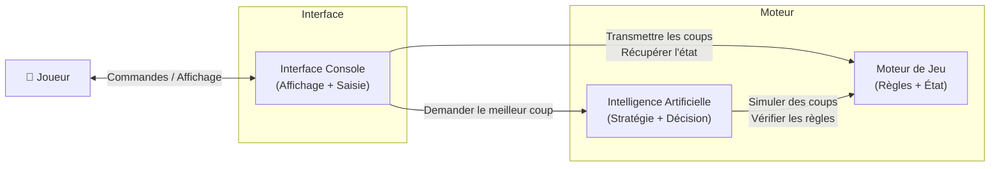
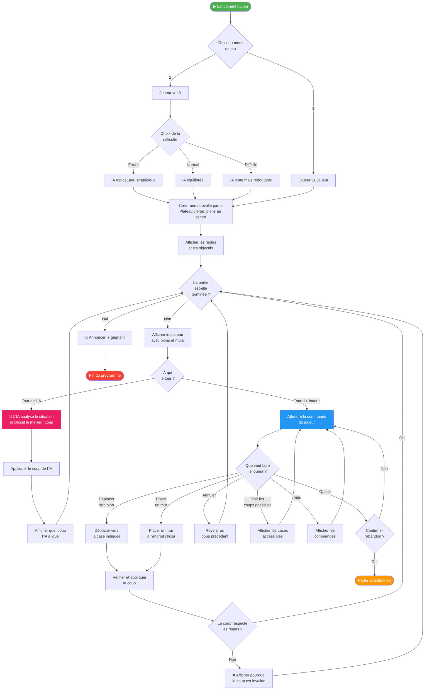

# 🎮 Vue Générale du Programme

Ce diagramme présente le flux principal du programme Quoridor, de son lancement à la fin de partie.

---

## Architecture des Modules

---

## Flux Principal du Programme

---

> **Légende :** Le programme alterne entre l'affichage du plateau et la gestion des tours (joueur humain ou IA) jusqu'à ce qu'un joueur atteigne le côté opposé du plateau.
