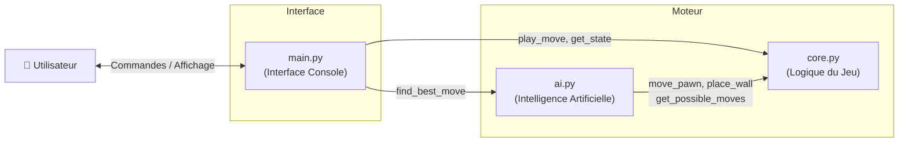
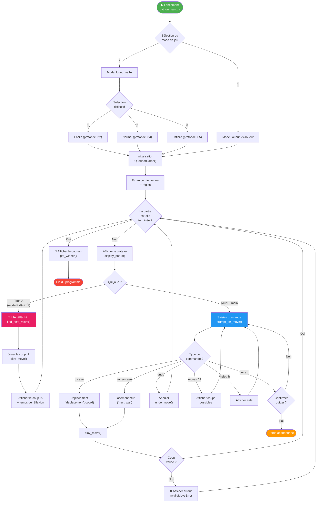

# 🎮 Vue Générale du Programme

Ce diagramme présente le flux principal du programme Quoridor, de son lancement à la fin de partie.

---

## Architecture des Modules

---

## Flux Principal du Programme

---

> **Légende :** Le flux principal alterne entre l'affichage du plateau et la gestion des tours (humain ou IA) jusqu'à la victoire d'un joueur.
