# 🎮 Vue Générale du Programme

Ce diagramme présente le flux principal du programme Quoridor, de son lancement à la fin de partie.

---

## Architecture des Modules

---

## Flux Principal du Programme

```mermaid
flowchart TD
    START(["▶ Lancement<br/>python main.py"]) --> MODE

    MODE{"Sélection du<br/>mode de jeu"}
    MODE -->|"1"| PVP["Mode Joueur vs Joueur"]
    MODE -->|"2"| PVIA["Mode Joueur vs IA"]
    PVIA --> DIFF{"Sélection<br/>difficulté"}
    DIFF -->|"1"| EASY["Facile (profondeur 2)"]
    DIFF -->|"2"| NORMAL["Normal (profondeur 4)"]
    DIFF -->|"3"| HARD["Difficile (profondeur 5)"]
    EASY --> INIT
    NORMAL --> INIT
    HARD --> INIT
    PVP --> INIT

    INIT["Initialisation<br/>QuoridorGame()"] --> WELCOME["Écran de bienvenue<br/>+ règles"]
    WELCOME --> LOOP

    LOOP{"La partie<br/>est-elle<br/>terminée ?"}
    LOOP -->|Non| DISPLAY["Afficher le plateau<br/>display_board()"]
    LOOP -->|Oui| END_GAME

    DISPLAY --> WHO{"Qui joue ?"}
    WHO -->|"Tour IA<br/>(mode PvIA + J2)"| AI_TURN
    WHO -->|"Tour Humain"| HUMAN_TURN

    %% --- Tour IA ---
    AI_TURN["🤖 L'IA réfléchit...<br/>find_best_move()"] --> AI_PLAY["Jouer le coup IA<br/>play_move()"]
    AI_PLAY --> AI_DISPLAY["Afficher le coup IA<br/>+ temps de réflexion"]
    AI_DISPLAY --> LOOP

    %% --- Tour Humain ---
    HUMAN_TURN["Saisie commande<br/>prompt_for_move()"] --> PARSE{"Type de<br/>commande ?"}

    PARSE -->|"d case"| MOVE_CMD["Déplacement<br/>('deplacement', coord)"]
    PARSE -->|"m h/v case"| WALL_CMD["Placement mur<br/>('mur', wall)"]
    PARSE -->|"undo"| UNDO_CMD["Annuler<br/>undo_move()"]
    PARSE -->|"moves / ?"| SHOW_MOVES["Afficher coups<br/>possibles"]
    PARSE -->|"help / h"| HELP["Afficher aide"]
    PARSE -->|"quit / q"| QUIT_CONFIRM{"Confirmer<br/>quitter ?"}

    MOVE_CMD --> TRY_PLAY
    WALL_CMD --> TRY_PLAY
    TRY_PLAY["play_move()"] --> VALID{"Coup<br/>valide ?"}
    VALID -->|Oui| LOOP
    VALID -->|Non| ERROR["❌ Afficher erreur<br/>InvalidMoveError"] --> LOOP

    UNDO_CMD --> LOOP
    SHOW_MOVES --> HUMAN_TURN
    HELP --> HUMAN_TURN
    QUIT_CONFIRM -->|Oui| ABANDON(["Partie abandonnée"])
    QUIT_CONFIRM -->|Non| HUMAN_TURN

    %% --- Fin de partie ---
    END_GAME["🎉 Afficher le gagnant<br/>get_winner()"] --> END_SCREEN(["Fin du programme"])

    %% --- Styles ---
    style START fill:#4CAF50,color:#fff
    style END_SCREEN fill:#f44336,color:#fff
    style ABANDON fill:#ff9800,color:#fff
    style AI_TURN fill:#E91E63,color:#fff
    style HUMAN_TURN fill:#2196F3,color:#fff
```

---

> **Légende :** Le flux principal alterne entre l'affichage du plateau et la gestion des tours (humain ou IA) jusqu'à la victoire d'un joueur.
