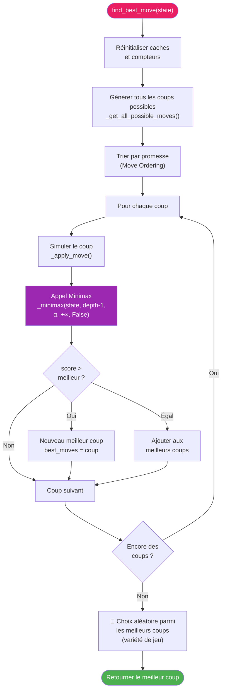
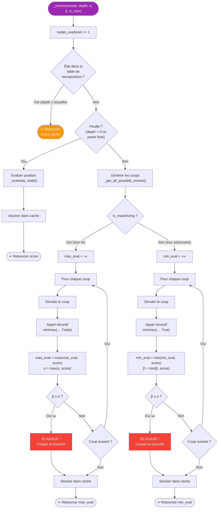
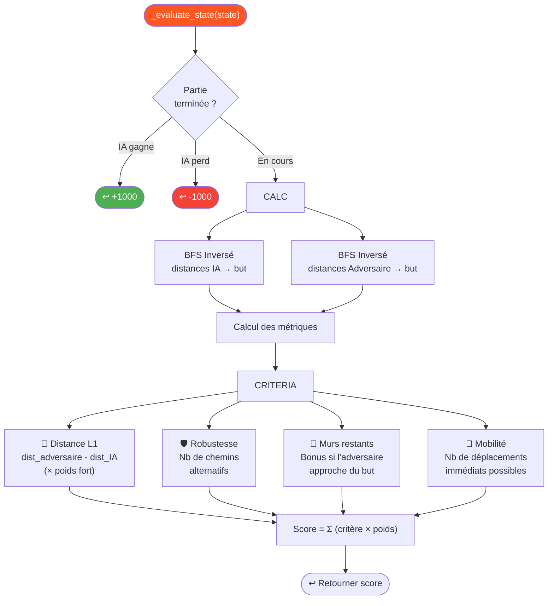
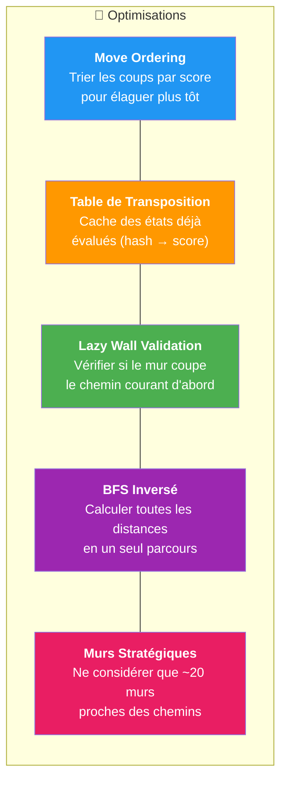

# 🤖 Logique de l'Intelligence Artificielle

Ce diagramme détaille le fonctionnement de l'IA du Quoridor, basée sur l'algorithme **Minimax avec élagage Alpha-Bêta**.

---

## Vue d'Ensemble de l'IA

---

## Algorithme Minimax avec Alpha-Bêta

---

## Fonction d'Évaluation Heuristique

---

## Optimisations de l'IA

---

> **Complexité :** Sans Alpha-Bêta → O(b^d). Avec Alpha-Bêta → O(b^(d/2)). Profondeur typique : 2 à 5 selon la difficulté.
