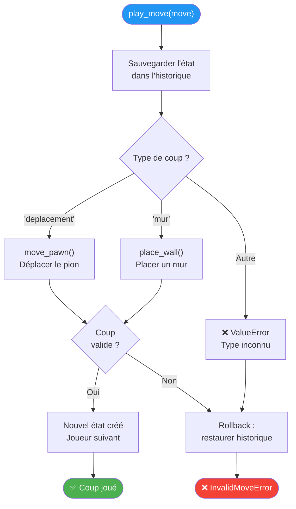
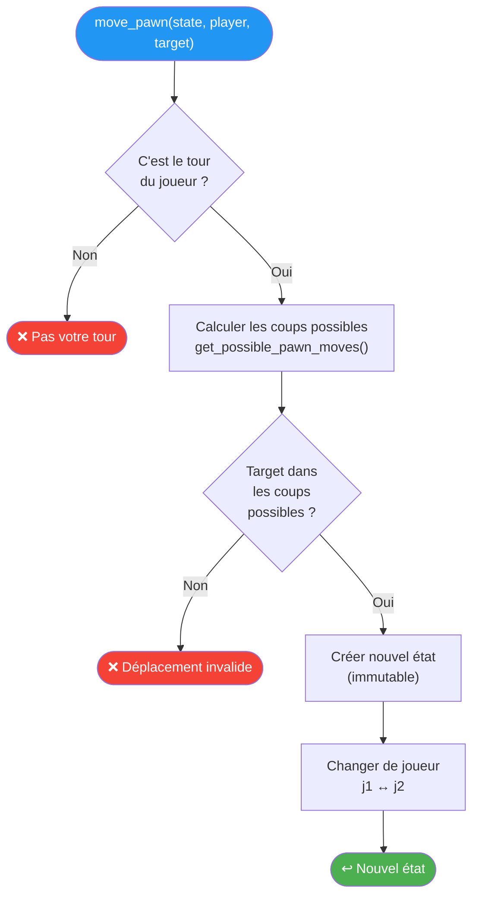
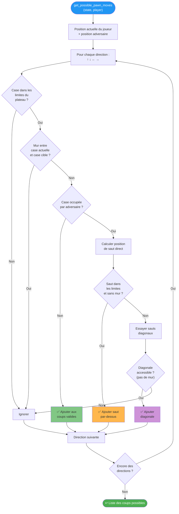
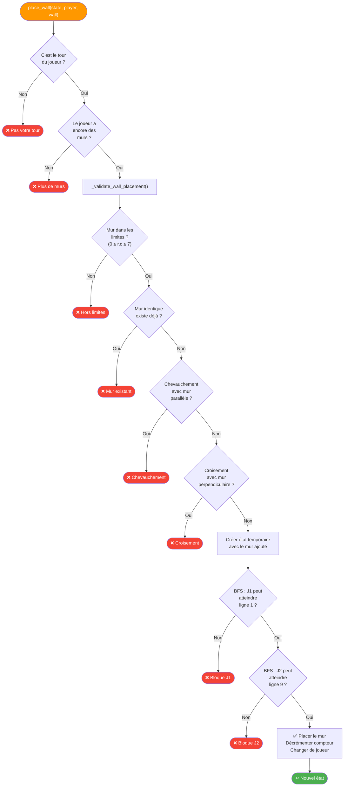
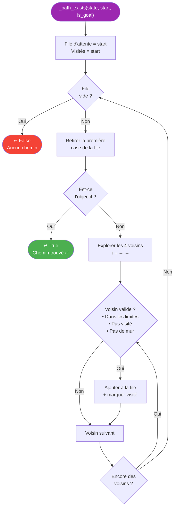

# 🎲 Logique et Règles du Jeu

Ce diagramme détaille les règles de validation des coups dans le moteur Quoridor (`core.py`).

---

## Flux Général d'un Coup

---

## Validation du Déplacement de Pion

---

## Calcul des Déplacements Possibles

---

## Validation du Placement de Mur

---

## Vérification de Chemin (BFS)

---

> **Principe clé :** Chaque coup crée un **nouvel état immuable** (pattern fonctionnel). L'état original n'est jamais modifié, ce qui permet l'historique et la fonction undo.
