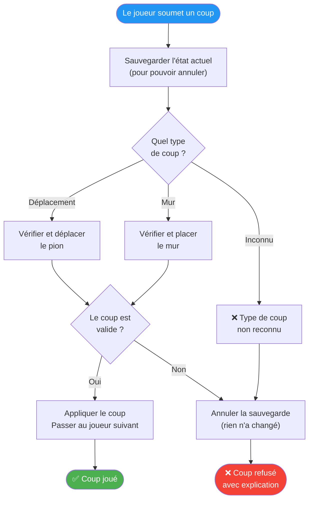
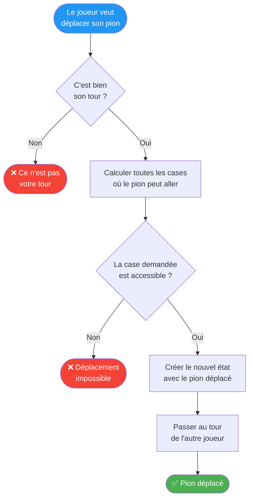
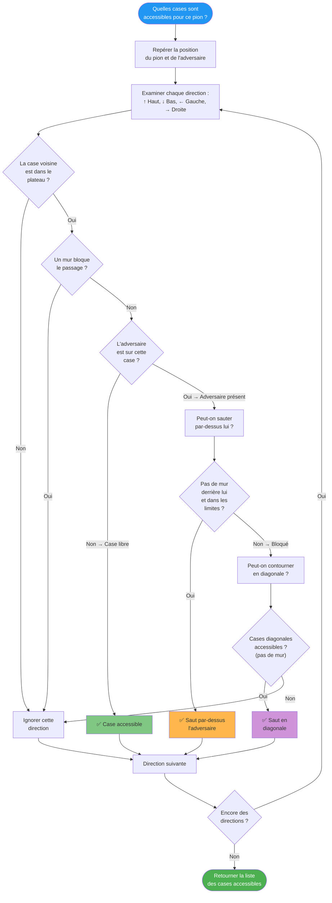
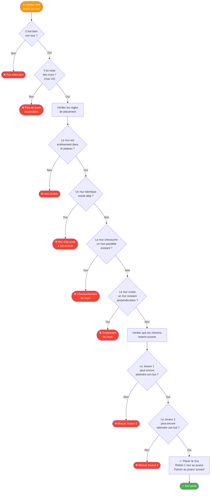
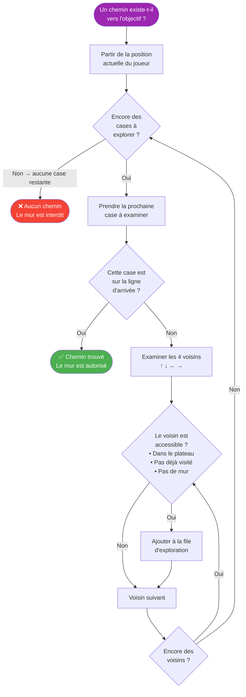

# 🎲 Logique et Règles du Jeu

Ce diagramme détaille comment le moteur de jeu valide et applique chaque coup selon les règles du Quoridor.

---

## Déroulement d'un coup

---

## Validation d'un déplacement de pion

---

## Comment sont calculées les cases accessibles

---

## Validation du placement d'un mur

---

## Recherche de chemin (un joueur peut-il encore gagner ?)

Cette vérification est cruciale : un mur ne peut **jamais** enfermer complètement un joueur.

---

> **Principe clé :** Chaque coup crée un **nouvel état du jeu** sans modifier le précédent. Cela permet d'annuler facilement un coup et à l'IA de simuler des parties futures sans risque.
