# 🎲 Logique et Règles du Jeu

Ce diagramme détaille les règles de validation des coups dans le moteur Quoridor (`core.py`).

---

## Flux Général d'un Coup

```mermaid
flowchart TD
    ENTRY(["play_move(move)"]) --> SAVE["Sauvegarder l'état<br/>dans l'historique"]
    SAVE --> TYPE{"Type de coup ?"}

    TYPE -->|"'deplacement'"| MOVE["move_pawn()<br/>Déplacer le pion"]
    TYPE -->|"'mur'"| WALL["place_wall()<br/>Placer un mur"]
    TYPE -->|"Autre"| ERR_TYPE["❌ ValueError<br/>Type inconnu"]

    MOVE --> SUCCESS
    WALL --> SUCCESS

    SUCCESS{"Coup<br/>valide ?"}
    SUCCESS -->|Oui| NEXT["Nouvel état créé<br/>Joueur suivant"] --> DONE(["✅ Coup joué"])
    SUCCESS -->|Non| ROLLBACK["Rollback :<br/>restaurer historique"]
    ROLLBACK --> ERROR(["❌ InvalidMoveError"])
    ERR_TYPE --> ROLLBACK

    style ENTRY fill:#2196F3,color:#fff
    style DONE fill:#4CAF50,color:#fff
    style ERROR fill:#f44336,color:#fff
```

---

## Validation du Déplacement de Pion

```mermaid
flowchart TD
    MOVE_START(["move_pawn(state, player, target)"]) --> TURN{"C'est le tour<br/>du joueur ?"}
    TURN -->|Non| ERR1(["❌ Pas votre tour"])
    TURN -->|Oui| POSSIBLE["Calculer les coups possibles<br/>get_possible_pawn_moves()"]

    POSSIBLE --> CHECK{"Target dans<br/>les coups<br/>possibles ?"}
    CHECK -->|Non| ERR2(["❌ Déplacement invalide"])
    CHECK -->|Oui| CREATE["Créer nouvel état<br/>(immutable)"]
    CREATE --> SWITCH["Changer de joueur<br/>j1 ↔ j2"]
    SWITCH --> RETURN(["↩ Nouvel état"])

    style MOVE_START fill:#2196F3,color:#fff
    style RETURN fill:#4CAF50,color:#fff
    style ERR1 fill:#f44336,color:#fff
    style ERR2 fill:#f44336,color:#fff
```

---

## Calcul des Déplacements Possibles

```mermaid
flowchart TD
    START(["get_possible_pawn_moves<br/>(state, player)"]) --> POS["Position actuelle du joueur<br/>+ position adversaire"]

    POS --> DIR["Pour chaque direction :<br/>↑ ↓ ← →"]
    DIR --> BOUNDS{"Case dans les<br/>limites du<br/>plateau ?"}
    BOUNDS -->|Non| SKIP["Ignorer"]
    BOUNDS -->|Oui| WALL_CHECK{"Mur entre<br/>case actuelle<br/>et case cible ?"}
    WALL_CHECK -->|Oui| SKIP
    WALL_CHECK -->|Non| OCC{"Case occupée<br/>par adversaire ?"}

    OCC -->|Non| ADD["✅ Ajouter aux<br/>coups valides"]

    OCC -->|Oui| JUMP_CALC["Calculer position<br/>de saut direct"]
    JUMP_CALC --> JUMP_OK{"Saut dans<br/>les limites<br/>et sans mur ?"}
    JUMP_OK -->|Oui| ADD_JUMP["✅ Ajouter saut<br/>par-dessus"]
    JUMP_OK -->|Non| DIAG["Essayer sauts<br/>diagonaux"]

    DIAG --> DIAG_CHECK{"Diagonale<br/>accessible ?<br/>(pas de mur)"}
    DIAG_CHECK -->|Oui| ADD_DIAG["✅ Ajouter<br/>diagonale"]
    DIAG_CHECK -->|Non| SKIP

    ADD --> NEXT["Direction suivante"]
    ADD_JUMP --> NEXT
    ADD_DIAG --> NEXT
    SKIP --> NEXT

    NEXT --> MORE{"Encore des<br/>directions ?"}
    MORE -->|Oui| DIR
    MORE -->|Non| RETURN(["↩ Liste des coups possibles"])

    style START fill:#2196F3,color:#fff
    style RETURN fill:#4CAF50,color:#fff
    style ADD fill:#81C784
    style ADD_JUMP fill:#FFB74D
    style ADD_DIAG fill:#CE93D8
```

---

## Validation du Placement de Mur

```mermaid
flowchart TD
    WALL_START(["place_wall(state, player, wall)"]) --> W_TURN{"C'est le tour<br/>du joueur ?"}
    W_TURN -->|Non| W_ERR1(["❌ Pas votre tour"])
    W_TURN -->|Oui| W_WALLS{"Le joueur a<br/>encore des<br/>murs ?"}
    W_WALLS -->|Non| W_ERR2(["❌ Plus de murs"])
    W_WALLS -->|Oui| VALIDATE

    VALIDATE["_validate_wall_placement()"] --> V1{"Mur dans les<br/>limites ?<br/>(0 ≤ r,c ≤ 7)"}
    V1 -->|Non| V_ERR1(["❌ Hors limites"])
    V1 -->|Oui| V2{"Mur identique<br/>existe déjà ?"}
    V2 -->|Oui| V_ERR2(["❌ Mur existant"])
    V2 -->|Non| V3{"Chevauchement<br/>avec mur<br/>parallèle ?"}
    V3 -->|Oui| V_ERR3(["❌ Chevauchement"])
    V3 -->|Non| V4{"Croisement<br/>avec mur<br/>perpendiculaire ?"}
    V4 -->|Oui| V_ERR4(["❌ Croisement"])
    V4 -->|Non| PATH_CHECK

    PATH_CHECK["Créer état temporaire<br/>avec le mur ajouté"] --> BFS1{"BFS : J1 peut<br/>atteindre<br/>ligne 1 ?"}
    BFS1 -->|Non| P_ERR(["❌ Bloque J1"])
    BFS1 -->|Oui| BFS2{"BFS : J2 peut<br/>atteindre<br/>ligne 9 ?"}
    BFS2 -->|Non| P_ERR2(["❌ Bloque J2"])
    BFS2 -->|Oui| PLACE["✅ Placer le mur<br/>Décrémenter compteur<br/>Changer de joueur"]
    PLACE --> W_RETURN(["↩ Nouvel état"])

    style WALL_START fill:#FF9800,color:#fff
    style W_RETURN fill:#4CAF50,color:#fff
    style V_ERR1 fill:#f44336,color:#fff
    style V_ERR2 fill:#f44336,color:#fff
    style V_ERR3 fill:#f44336,color:#fff
    style V_ERR4 fill:#f44336,color:#fff
    style P_ERR fill:#f44336,color:#fff
    style P_ERR2 fill:#f44336,color:#fff
    style W_ERR1 fill:#f44336,color:#fff
    style W_ERR2 fill:#f44336,color:#fff
```

---

## Vérification de Chemin (BFS)

```mermaid
flowchart TD
    BFS_START(["_path_exists(state, start, is_goal)"]) --> INIT["File d'attente = start<br/>Visités = start"]

    INIT --> EMPTY{"File<br/>vide ?"}
    EMPTY -->|Oui| NO_PATH(["↩ False<br/>Aucun chemin"])
    EMPTY -->|Non| DEQUEUE["Retirer la première<br/>case de la file"]

    DEQUEUE --> GOAL{"Est-ce<br/>l'objectif ?"}
    GOAL -->|Oui| FOUND(["↩ True<br/>Chemin trouvé ✅"])
    GOAL -->|Non| EXPLORE["Explorer les 4 voisins<br/>↑ ↓ ← →"]

    EXPLORE --> NEIGHBOR{"Voisin valide ?<br/>• Dans les limites<br/>• Pas visité<br/>• Pas de mur"}
    NEIGHBOR -->|Oui| ENQUEUE["Ajouter à la file<br/>+ marquer visité"]
    NEIGHBOR -->|Non| NEXT_N["Voisin suivant"]
    ENQUEUE --> NEXT_N
    NEXT_N --> MORE_N{"Encore des<br/>voisins ?"}
    MORE_N -->|Oui| NEIGHBOR
    MORE_N -->|Non| EMPTY

    style BFS_START fill:#9C27B0,color:#fff
    style FOUND fill:#4CAF50,color:#fff
    style NO_PATH fill:#f44336,color:#fff
```

---

> **Principe clé :** Chaque coup crée un **nouvel état immuable** (pattern fonctionnel). L'état original n'est jamais modifié, ce qui permet l'historique et la fonction undo.
