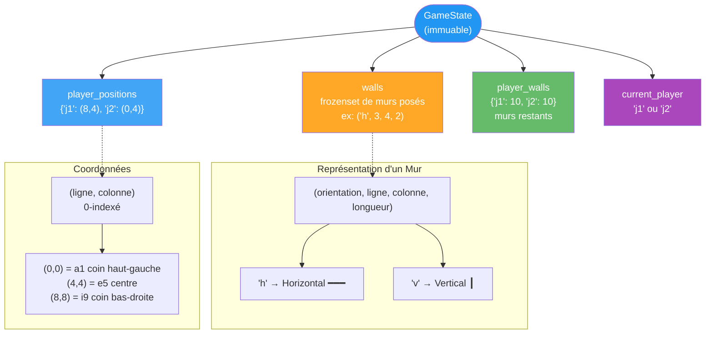
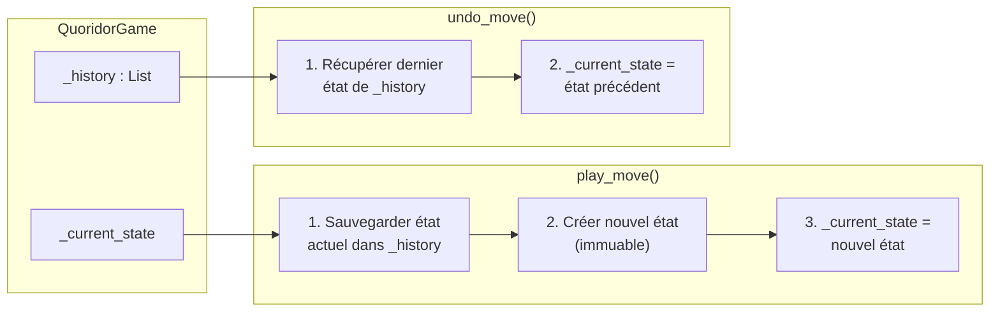
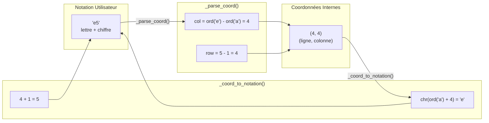
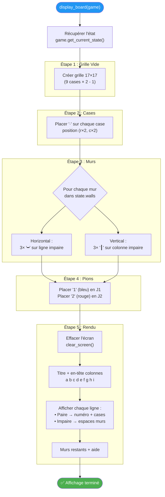
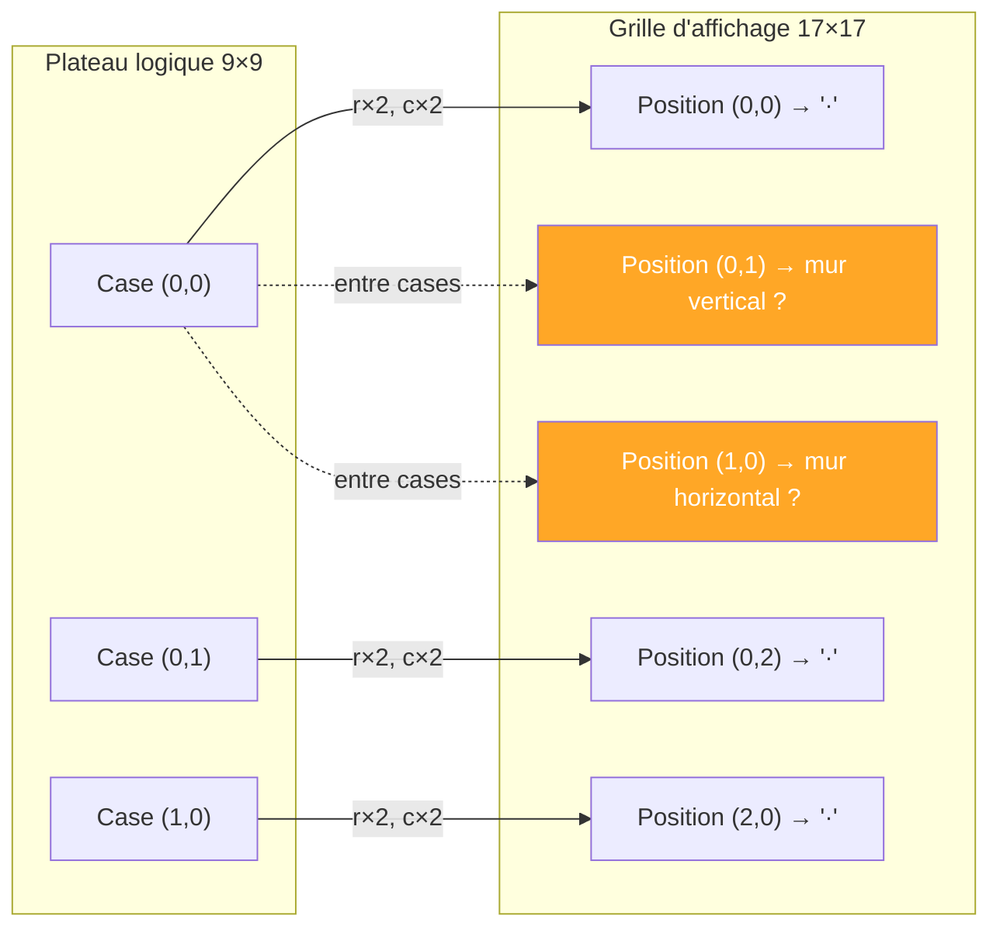

# 🖥️ Gestion et Affichage du Plateau

Ce diagramme explique comment l'état du jeu est structuré, stocké, et affiché dans le terminal.

---

## Structure de Données : GameState

---

## Gestion de l'Historique (Undo)

---

## Conversion Coordonnées

---

## Processus d'Affichage du Plateau

---

## Correspondance Grille 9×9 → Grille 17×17

---

> **Principe clé :** La grille 17×17 intercale les cases (positions paires) et les espaces pour murs (positions impaires), permettant un rendu ASCII élégant avec murs visibles.
