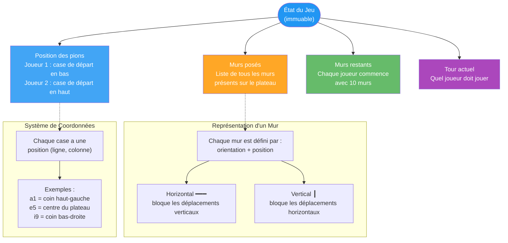
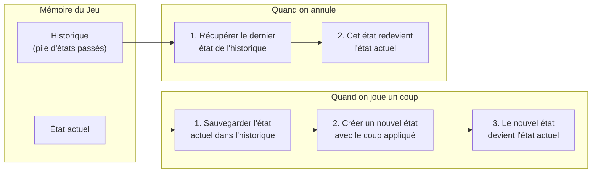
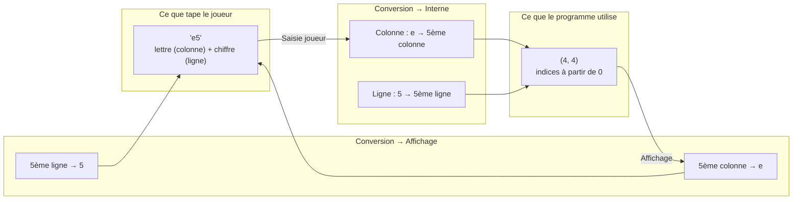
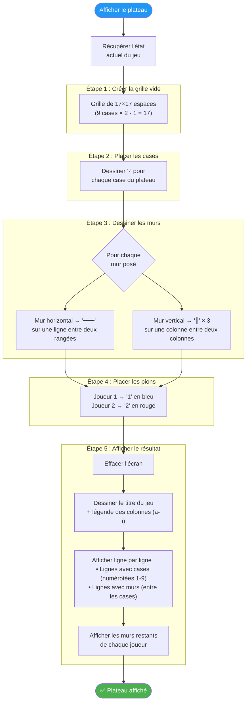
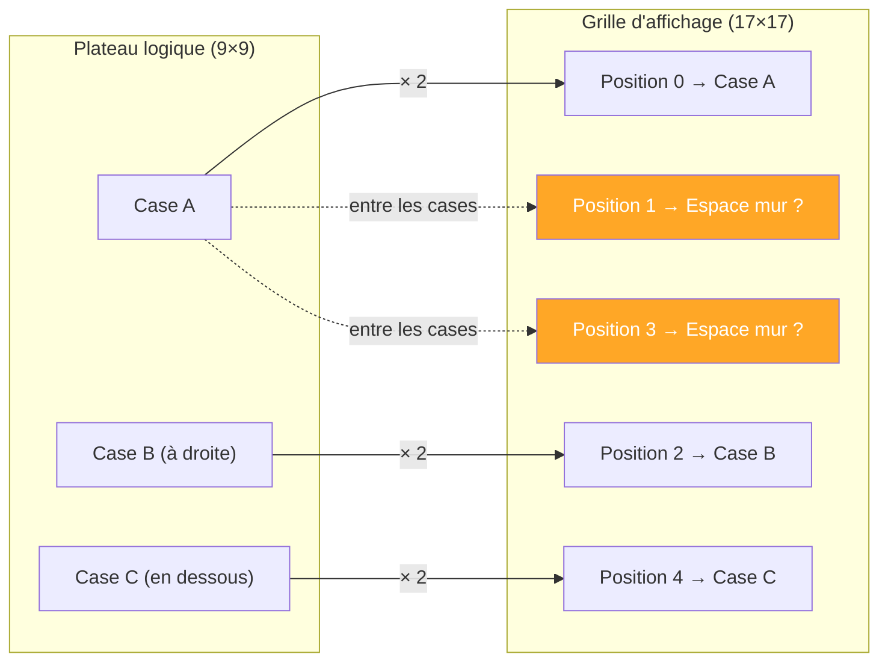

# 🖥️ Gestion et Affichage du Plateau

Ce diagramme explique comment l'état du jeu est structuré, stocké et affiché dans le terminal.

---

## Structure de l'État du Jeu

Toutes les informations d'une partie sont regroupées dans un **état de jeu** immuable (non modifiable une fois créé).

---

## Gestion de l'Historique (Annuler un coup)

Le jeu conserve un historique de tous les états précédents, ce qui permet d'annuler des coups.

---

## Conversion des Coordonnées

Le joueur utilise une notation intuitive (type échecs), que le programme convertit en coordonnées internes.

---

## Comment le Plateau est Affiché

Le plateau de 9×9 cases est converti en une grille de 17×17 caractères pour pouvoir dessiner les murs entre les cases.

---

## Pourquoi 17×17 au lieu de 9×9 ?

> Les positions **paires** contiennent les cases, les positions **impaires** sont réservées aux murs. C'est ce qui permet d'afficher les murs entre les cases.

---

> **Principe clé :** La grille 17×17 intercale les cases et les espaces pour murs, permettant un rendu ASCII élégant où chaque mur est visible entre les cases qu'il bloque.
